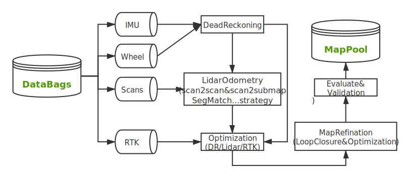

 
## lidar mapping(0610-TBD)
 

#### 点云建图算法框架
- 前段
  - DR: 航迹推算
  - Lidar Odometry
    - imu预积分
    - scan2scan及scan2neighbormap(模拟人走路的单步估计及局部环境估计)
- 闭环(消除重影 与 多轨迹拼接)
  - 欧氏距离方法
  - 基于submap(类似Cartographer, 但无法解决submap内的退化或匹配失败) or Keyframe
  - 分支界定法多分辨率回环检测
  - 基于环境特征的loop
- 后端
  - 因子图优化(RTK/DR/Lidar/Loop...Height/全局姿态因子/人工标注因子)
- 精度评估及测试发布

 

#### 自动化建图架构原则
- 可拓展不同里程计(DR,lidar-odometry[multiple matching methods]、visual-odometry...)
- 可拓展不同回环检测方法
- 同时支持局部坐标和utm坐标地图构建
- 实时回环检测及全局优化 
- 建图过程可视化
- 分步建图，各步骤独立,可从任一中间步骤继续建图
- 云服务器端自动化建图

#### 建图提升方向
- 建图效率及成功率
- 削弱特定场景(广场/隧道...)下环境传感器(lidar/camera)退化的影响.(更多依靠内在传感器DR,如imu-wheel)
- 检测及剔除RTK异常数据(RTK固定解状态时跳变,延迟等)
- 弱GPS区域(GPS信号不稳定或遮挡)建图问题
- GPS严重遮挡区域锚点的选取
- 回环检测消除重影
- 后端融合优化
- 多路段拼接

#### 建图疑难点 
- 锚点不均匀区域建图的解决 
- 轨迹无闭环的弱GPS区域建图问题(Partial Observation)

ref
[(高翔)非结构化环境中的大规模点云地图自动化构建方法](https://mp.weixin.qq.com/s?__biz=MzIyMjAxNDIwNw==&mid=2649064123&idx=1&sn=02e56549764cc7042687cf74e0ecc944&chksm=f022dd2bc755543d6291145cf54763a6dad2336ee576a95558050ab204635d1dce81d64e7675&mpshare=1&scene=1&srcid=0608Hn7XFGjyD4LFLj1MNwbk&sharer_sharetime=1623213303786&sharer_shareid=3dc5f5a850e8b381b46b7985713d3bed&exportkey=AUvxPqOPPDmv0RCNqgsEbi4%3D&pass_ticket=lf4jX7wv%2FujnmpaVttlOv%2FkN1m6y5i6czixgvR8aIYPCquU7tB6bfVd7%2FHmjtfnI&wx_header=0#rd)
对应论文**Fully Automatic Large-Scale Point Cloud Mapping for Low-Speed Self-Driving Vehicles in Unstructrered Environments**位于32th IEEE Intelligent Vehicles Symposium,2021 meeting

