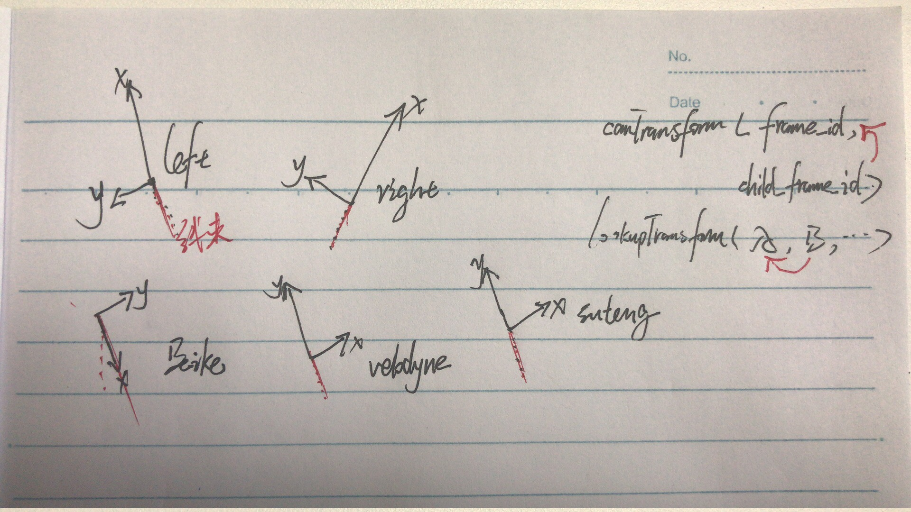
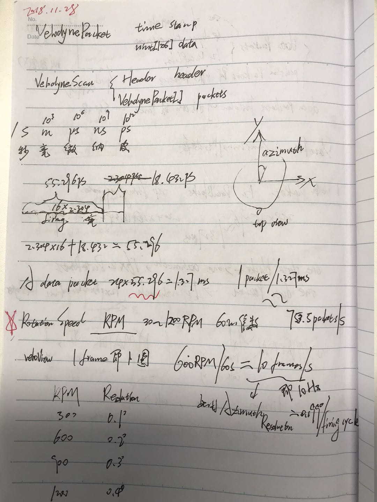
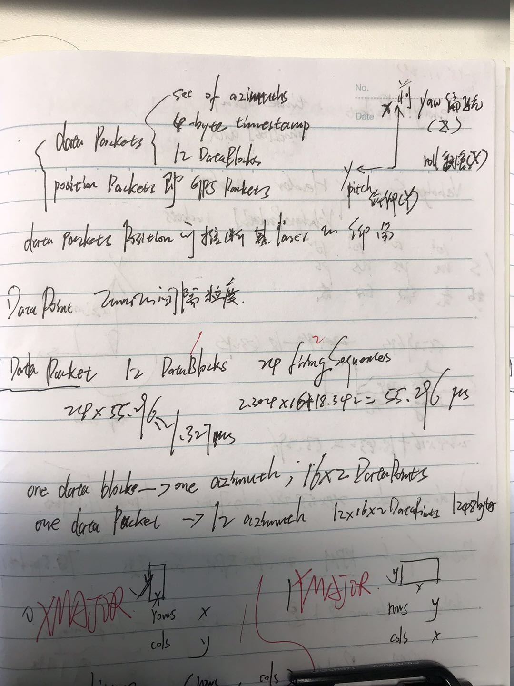

# 机械雷达原理(Velodyne为例)
## 时间戳单位换算
 
$$
\begin{aligned}
1 \mathbf{second} &= 10^3 (\mathbf{ms 毫秒 \quad millisecond}) \\\\
 & = 10^6 us 微秒(\mathbf{microseconds}) \\\\
 & = 10^9 ns 纳秒(\mathbf{nanosecond}) 
\end{aligned}
$$
 

## 不同雷达坐标系

>velodyne、速腾、北科

## velodyne基本原理

  

| options          | content                                                                                                        |
| :--------------- | :------------------------------------------------------------------------------------------------------------- |
| RPM              | $\mathbf{600  rpm/min = 10 frames/s = 1 frame/100 ms= 10Hz}$                                                   |
| 测距精度         | $\mathbf{0.2 cm   }$                                                                                           |
| 角度精度         | $Angular Resolution = \dfrac{360^o}{\frac{100ms}{1.327ms}\times12\times2} = 0.19905^o  \approx \mathbf{0.2° }$ |
| 数据单位         | $\mathbf{1 DataPacket = 12 DataBlocks = 24 FiringSeques}$                                                      |
| DataPack时间计算 | $1\times12\times2\times55.296=1.327ms$                                                                         |
|                  | $1Packet/1.327ms\approx754Packets/s$                                                                           |

 
