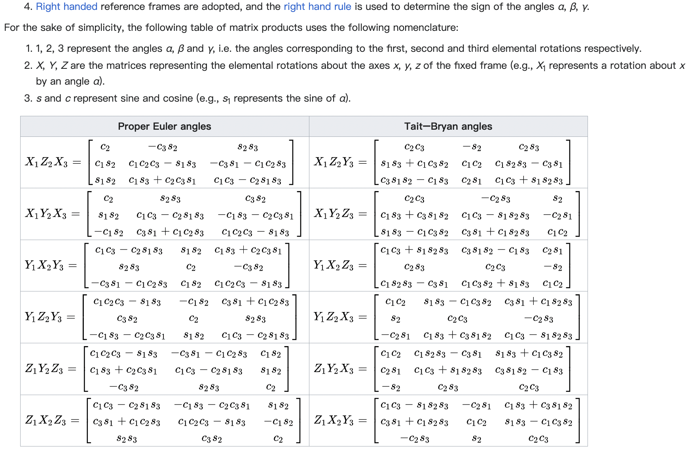
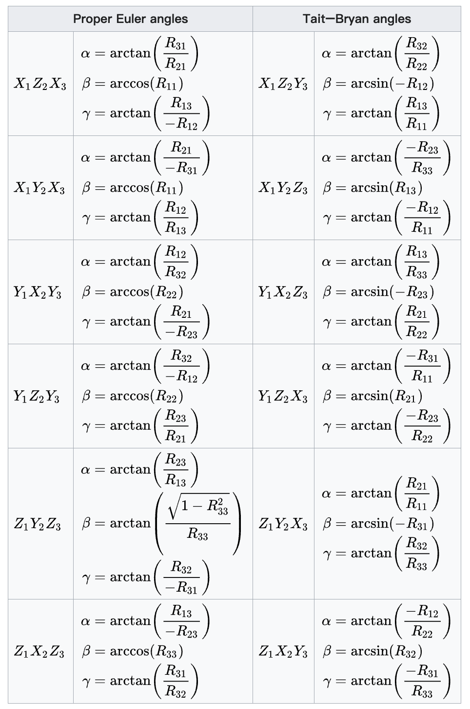
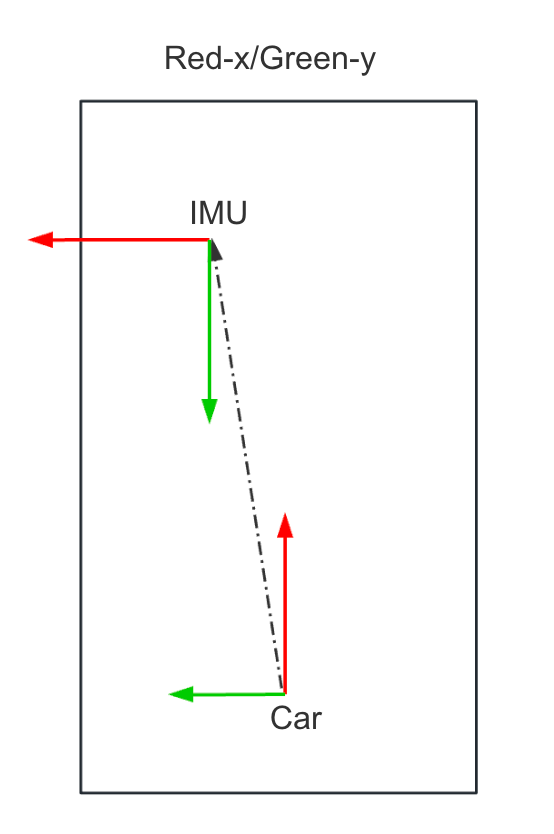

# 刚体运动-三维旋转变换-2023


### Notations(paper-lio)

- denote the transformation matrix as $\mathbf{T}_b^a \in  SE(3)\,[b \to a]$, which transforms the point $\mathbf{x}^b \in \mathbb{R}^3$ in the frame $\mathcal{F}_b$ into the frame $\mathcal{F}_a$,just as [$\mathbf{T}_L^I$ -> lidar / imu, transform point $P$ from lidar frame $\mathcal{F}_{lidar}$ to imu frame $\mathcal{F}_{imu}$].
- denote the raw measurements of the IMU at timestamp $\mathcal{k}$ as $\hat{a}_k$ and $\hat{w}_k$.
- denote the extracted features as $\mathbf{F}_a$ in original $\mathcal{F}_{lidar}$,which can be transformed into the frame $\mathcal{F}_b$ as $\mathbf{F}_a^b$.
- robot body frame $\mathcal{F}_B \to imu$, and lidar body frame$\mathcal{F}_L \to lidar$

### Euler角(ypr为例)

生成旋转矩阵的一种简单方式是把它作为三个基本旋转的序列复合。关于右手笛卡尔坐标系的 $X \quad Y \quad Z$轴的旋转分别为$roll \quad pitch \quad yaw$。因为这些旋转被表达为关于一个轴的旋转，它们的生成元很容易表达

专业主流资料中对于欧拉角等表示方法的定义一般为下表：
也有非专业资料自定义$\alpha \quad \beta \quad \gamma$为欧拉角的三个角度表示$roll, pitch, yaw$


| Axis         | Z         | Y         | X         |
| ------------ | --------- | --------- | --------- |
| euler        | yaw       | pitch     | roll      |
| greek letter | $\psi$    | $\theta$  | $\phi$    |
| order        | $X \to Y$ | $Z \to X$ | $Y \to Z$ |

欧拉角的旋转顺序为$ZYX$，即先绕Z轴旋转，再绕Y轴旋转，最后绕X轴旋转,**注意绕$Y$轴旋转相当于是以已知系为参考系**,见如下示例


#### 旋转矩阵分量
- 绕 x-轴的主动旋转定义为:
  $$
  R_x(\theta _x) = 
  \begin{bmatrix}
  1& 0& 0 \\\\
  0& cos\theta_x& -sin\theta_x \\\\
  0& sin\theta_x& cos\theta_x
  \end{bmatrix}
  $$
  此处$\theta_x$即为roll角，yz平面顺时针
- 绕 y-轴的主动旋转定义为:
  $$
  R_y(\theta _y) = 
  \begin{bmatrix}
  cos\theta_y&  sin\theta_y& 0 \\\\
  0& 1& 0 \\\\
  -sin\theta_y& cos\theta_y& 0
  \end{bmatrix}
  $$
  此处$\theta_y$即为pitch角，zx平面顺时针
- 绕 z-轴的主动旋转定义为:
  $$
  R_z(\theta _z) = 
  \begin{bmatrix}
  cos\theta_z& -sin\theta_z& 0 \\\\
  sin\theta_z& cos\theta_z& 0 \\\\
  0& 0& 1
  \end{bmatrix}
  $$
  此处$\theta_z$即为yaw角，xy平面顺时针


 
#### **目标系为参考系,主流(e.g)**
>示例(enu<->local)

- 已知局部坐标系下坐标$P_{local}(x,y,yaw| \psi)$, $yaw 即  \psi$是相对东北天$ENU$系，则enu坐标系下坐标$P_{enu}(x_{enu},y_{enu})$为:
  
$$
P_{enu} = 
\begin{bmatrix}
    x_{enu} \\\\
    y_{enu}
\end{bmatrix}
=
\begin{bmatrix}
    cos \psi, & -sin \psi \\\\
    sin \psi, & cos \psi
\end{bmatrix}
\begin{bmatrix}
    x_{local} \\\\
    y_{local}
\end{bmatrix}  
$$

$$
\text{备注：以目标系enu为参考系, yaw为在目标系enu下角度, 主流常用} 
$$

- 已知enu坐标系下坐标$P_{enu}(x,y,yaw| \psi)$, $yaw 即  \psi$是相对东北天$ENU$系，则local坐标系下坐标$P_{local}(x_{local},y_{local})$为
 
$$
P_{local} =  
\begin{bmatrix}
    cos (-\psi), & -sin (-\psi) \\\\
    sin (-\psi), & cos (-\psi)
\end{bmatrix}
\begin{bmatrix}
    x_{enu} \\\\
    y_{enu}
\end{bmatrix} = 
\begin{bmatrix}
    cos \psi , &  sin  \psi  \\\\
    -sin  \psi , & cos  \psi 
\end{bmatrix}
\begin{bmatrix}
    x_{enu} \\\\
    y_{enu}
\end{bmatrix}
$$

$$
\text{备注：以目标系local为参考系, enu相对local角度为 -yaw, 少用以避免歧义}  
$$
 
#### wiki欧拉角和旋转矩阵互转参考
在飞行动力学中，roll - $\gamma$, pitch - $\alpha$ 和 yaw - $\beta$ , 但是为了避免混淆于欧拉角这里使用符号 $\theta _{x}$, $\theta _{y}$, $\theta _{z}$分别表示绕$X \quad Y \quad Z$(右手-Xfront-Yleft-Zup)轴旋转的$roll、pitch、yaw$

**如$Z_1Y_2X_3$的旋转矩阵R中的$1,2,3$分别表示$yaw \quad pitch \quad roll$**

[ref wikibaike](https://en.wikipedia.org/wiki/Euler_angles)




### 示例代码
#### euler -> R(ypr) 
```py
import math
import numpy as np
def matrix_to_euler_zyx(R):
    sy = np.sqrt(R[0, 0] * R[0, 0] + R[1, 0] * R[1, 0])
    singular = sy < 1e-6
    if not singular:
        yaw = np.arctan2(R[1, 0], R[0, 0])
        pitch = np.arcsin(-R[2, 0])
        roll = np.arctan2(R[2, 1], R[2, 2])
    else:
        yaw = 0
        pitch = np.arctan2(-R[2, 0], sy)
        roll = np.arctan2(-R[1, 2], R[1, 1])
    return np.array([yaw, pitch, roll])

def ypr_to_R(yaw_rad=0, pitch_rad=0, roll_rad=0):
    sin_yaw = math.sin(yaw_rad)
    cos_yaw = math.cos(yaw_rad)
    value = [cos_yaw, -sin_yaw, 0, 
             sin_yaw, cos_yaw, 0, 
             0, 0, 1]
    R_yaw = np.array(value).reshape(3, 3) 

    sin_pitch = math.sin(pitch_rad)
    cos_pitch = math.cos(pitch_rad)
    value = [cos_pitch, 0, sin_pitch, 
             0, 1, 0, 
             -sin_pitch, 0, cos_pitch]
    R_pitch = np.array(value).reshape(3, 3)

    sin_roll = math.sin(roll_rad)
    cos_roll = math.cos(roll_rad)
    value = [1, 0, 0, 
             0, cos_roll, -sin_roll,
             0, sin_roll, cos_roll]
    R_roll = np.array(value).reshape(3, 3)
    #R_ypr =  Ry * Rp * Rr;
    R_ypr = np.dot(np.dot(R_yaw, R_pitch), R_roll) 
    return R_ypr
``` 
#### enler <-> Quaternion
- enluer2quaternion by python
```py
import numpy as np
def euler_to_quaternion(yaw, pitch,roll): #angles are in radians
    # Abbreviations for the various angular functions
    cy = np.cos(yaw * 0.5)
    sy = np.sin(yaw * 0.5)
    cp = np.cos(pitch * 0.5)
    sp = np.sin(pitch * 0.5)
    cr = np.cos(roll * 0.5)
    sr = np.sin(roll * 0.5)

    w = cy * cp * cr + sy * sp * sr
    x = cy * cp * sr - sy * sp * cr
    y = sy * cp * sr + cy * sp * cr
    z = sy * cp * cr - cy * sp * sr

    return [w, x, y, z]
```
- quaternion<->euler by cpp
```cpp
//ref: https://en.wikipedia.org/wiki/Conversion_between_quaternions_and_Euler_angles#cite_note-2
struct EulerAngles {
    double roll, pitch, yaw;
};
struct Quaternion
{
    double w, x, y, z;
};
 
Quaternion Normalize(const Quaternion& q) {
    auto func_norm = [](Quaternion& q) {
        return std::sqrt(q.w * q.w + q.x * q.x + q.y * q.y + q.z * q.z);
    };
    double n = func_norm(q);
    if (n == 0.0) {
        return q; // 避免除以零的情况
    }
    return {q.w / n, q.x / n, q.y / n, q.z / n};
}

// roll (x), pitch (y), yaw (z), angles are in radians
Quaternion EulerVector2Quaternion(Eigen::Vector3d vec) {
  const double angle = vec.norm();
  if (angle < 1e-8) {
    Quaternion q(1.0, 0.5 * vec.x(), 0.5 * vec.y(), 0.5 * vec.z());
    q.normalize();
    return q;
  }
  vec /= angle;
  return Quaternion(AngleAxis(angle, vec));
}
Quaternion EulerAnglesToQuaternion(double roll, double pitch, double yaw) {
    // Abbreviations for the various angular functions
    double cr = cos(roll * 0.5);
    double sr = sin(roll * 0.5);
    double cp = cos(pitch * 0.5);
    double sp = sin(pitch * 0.5);
    double cy = cos(yaw * 0.5);
    double sy = sin(yaw * 0.5);

    Quaternion q;
    q.w = cr * cp * cy + sr * sp * sy;
    q.x = sr * cp * cy - cr * sp * sy;
    q.y = cr * sp * cy + sr * cp * sy;
    q.z = cr * cp * sy - sr * sp * cy;

    return q;
}
 
EulerAngles QuaternionToEulerAngles(Quaternion q_raw) {
    //quaternion need to be normalized first
    auto q = Normalize(q_raw);
    EulerAngles angles;
    
    //converts to Euler angles in 3-2-1 sequence
    //atan(y/x) result is in [-pi/2, pi/2], atan2(y,x) result is in [-pi, pi]
    // roll (x-axis rotation)
    double sinr_cosp = 2 * (q.w * q.x + q.y * q.z);
    double cosr_cosp = 1 - 2 * (q.x * q.x + q.y * q.y);
    angles.roll = std::atan2(sinr_cosp, cosr_cosp); 

    // pitch (y-axis rotation)
    double sinp = std::sqrt(1 + 2 * (q.w * q.y - q.x * q.z));
    double cosp = std::sqrt(1 - 2 * (q.w * q.y - q.x * q.z));
    angles.pitch = 2 * std::atan2(sinp, cosp) - M_PI / 2;

    // yaw (z-axis rotation)
    double siny_cosp = 2 * (q.w * q.z + q.x * q.y);
    double cosy_cosp = 1 - 2 * (q.y * q.y + q.z * q.z);
    angles.yaw = std::atan2(siny_cosp, cosy_cosp);

    return angles;
}

function q = RotationMatrixToQuaterion (R)
  w = sqrt(1 + trace(R)) * 0.5;
  w4_inv = 1.0 / (4.0 * w);
  x = (R(3,2) - R(2,3)) * w4_inv;
  y = (R(1,3) - R(3,1)) * w4_inv;
  z = (R(2,1) - R(1,2)) * w4_inv;
  q = [w, x, y, z];
  q = q / norm(q);
endfunction
```
 
### 杆臂的对速度的影响(`与R结合`)

物理定律 `速度=角度速度*半径`$\quad v = w \times R$

如通过a点速度求b点速度，则需要利用a点的角速度$w$和向量$a \to b$,即b相对a的$L_{ab}$

$$
v_b = v_a + \Delta v = v_a + w \times L_{ab}
$$

**速度-杆臂转换示例如下**:
<!-- 
 -->


- imu在global系下姿态为 $R_g$, 速度为 $v_g$, imu角速度测量为 $w$
- 自车系在$IMU$系下杆臂为 $L_{ic}$
- imu系在自车系下姿态为 $R_{ci}$

则自车系速度为(后轴中心):

- 对$v_g$姿态旋转: 先转到imu自身系,再转到Car自车系，结果为imu位置自车系下速度
- 通过杆臂$imu \to car$ 即  $L_{ic}$求得imu系下后轴中心相对的速度增量(物理定律: 角度速度*半径=速度)，然后转到自车系下
 
$$
V_{vcs} = R_{ci} \cdot R_g^{-1} \cdot v_g  +  R_{ci} \cdot w \times L_{ic}
$$

- example code: 
  
  ```cpp
  //v = w x R,物理定律: 角度速度*半径=速度
  // v_a = v_b + w*l, l为b->a
  /*
  * R_imu_in_car:  imu/car    R_global_in_imu: global/imu
  * leverarm_imu_car: car/imu
  */
  const double velocity_vcs_y =
        (R_imu_in_car * R_global_in_imu * global_vehicle_imu +
         R_imu_in_car * imu_omega.cross(leverarm_car_in_imu)).y();
  /*
  1. imu位置的global系下速度通过R_global_in_imu转到imu自身系下速度
  2. imu位置自身系下速度通过R_imu_in_car转到car自车系下姿态的速度,得到Va
  3. 通过imu_omega和leverarm[car/imu]计算delta_velocity并转到自车系下,得到delta_v
  4. 则最终后轴原点(即car位置)自车系下速度为Va+delta_v
  */
  ``` 
 

### jacobian of quaternion
#### 正旋转对正旋转的导数
参见`Joan-Sola-1773-Quaternion-kinematics-for-the-error-state-Kalman-filter`的paper里公式$171 \to 174$

 

$$
\dfrac{\partial( \mathbf{q} \otimes \mathbf{a} \otimes \mathbf{q} \ast)} {\partial \mathbf{q}}
$$
  

#### 逆旋转对正旋转的导数推到如下

$$
\mathbf{q} = [w,\mathbf{v}] \\\\
\mathbf{q}\ast = \mathbf{q}^{-1} = [w, -\mathbf{v}] \\\\
$$

$$
\text{则逆旋转对正旋转的导数如下}
$$

$$
\frac{\partial( \mathbf{q1} \otimes \mathbf{a} \otimes \mathbf{q1}\ast )} {\partial \mathbf{q}}
$$

$$
\begin{aligned}
&\mathbf{q} = [w,\mathbf{v}] \\
&\mathbf{q1} = \mathbf{q}^{-1} = \mathbf{q}\ast = [w, -\mathbf{v}] \\\\ 
\end{aligned}
$$

$$
\begin{aligned}
 {a}'_{inv} &=  \mathbf{q1} \otimes \mathbf{a} \otimes \mathbf{q1\ast} \\\\
 &=\mathbf{q\ast} \otimes \mathbf{a} \otimes \mathbf{q} \\\\
 &=(w - \mathbf{v}) \otimes \mathbf{a} \otimes (w + \mathbf{v}) \\\\
 &= ... \\\\
 &=w^2\cdot \mathbf{a} + 2w \cdot \mathbf{a} \otimes \mathbf{v} - \mathbf{v} \otimes \mathbf{a} \otimes \mathbf{v} \\\\
 &= w^2\cdot \mathbf{a} + 2w \cdot \mathbf{a} \times \mathbf{v} + 2(\mathbf{v}^T \mathbf{a})\mathbf{v} - (\mathbf{v}^T \mathbf{v})\mathbf{a} \\\\
\end{aligned}
$$

$$
\begin{align}
 \frac{\partial( \mathbf{q1} \otimes \mathbf{a} \otimes \mathbf{q1\ast} )} {\partial \mathbf{q}} &=
 \frac{\partial( \mathbf{q\ast} \otimes \mathbf{a} \otimes \mathbf{q} )} {\partial \mathbf{q}} \\\\
 &= 2[w\mathbf{a} + \mathbf{a}\times \mathbf{v} \quad| \quad  
 \mathbf{v}^T\mathbf{a}\mathbf{I_3} + \mathbf{v}\mathbf{a}^T - \mathbf{a}\mathbf{v}^T + w[a]_{\times}] \in \mathbf{R}^{3\times 4} 
\end{align}
$$
  

- example code:

  ```cpp
  Eigen::Matrix<double, 3, 4> JacobianOfInverseRotation2Quaternion(
      const Eigen::Quaternion& q, const Eigen::Vector3d& a) {
    Eigen::Matrix<double, 3, 4> result;
    const double qw = q.w();
    const Vec3d qv = q.vec();
    result.block<3, 1>(0, 0) = 2.0 * (qw * a + a.cross(qv));
    result.block<3, 3>(0, 1) =
        2.0 * (qv.transpose() * a * Eigen::Matrix3d::Identity() + qv * a.transpose() -
               a * qv.transpose() + qw * SkewSymmetricMatrix(a));
  
    return result;
  }
  ```

### 左右Jacobian(gpt-需要验证)
#### 左右Jacobian-基于欧拉角
对于欧拉角，我们使用 ZYX（Yaw-Pitch-Roll）顺序的欧拉角表示旋转。给定欧拉角 $(\psi, \theta, \phi)$，其中 $\psi$ 是偏航角（Yaw），$\theta$ 是俯仰角（Pitch），$\phi$ 是滚动角（Roll），其对应的旋转矩阵 $R$ 为：

$$
R = R_z(\psi) \cdot R_y(\theta) \cdot R_x(\phi)
$$

其中 $R_x(\phi)$、$R_y(\theta)$ 和 $R_z(\psi)$ 分别是绕 X、Y 和 Z 轴的旋转矩阵。

1. **绕 X 轴的旋转矩阵 $R_x(\phi)$:**

$$
R_x(\phi) = \begin{bmatrix}
1 & 0 & 0 \\
0 & \cos(\phi) & -\sin(\phi) \\
0 & \sin(\phi) & \cos(\phi)
\end{bmatrix}
$$

2. **绕 Y 轴的旋转矩阵 $R_y(\theta)$:**

$$
R_y(\theta) = \begin{bmatrix}
\cos(\theta) & 0 & \sin(\theta) \\
0 & 1 & 0 \\
-\sin(\theta) & 0 & \cos(\theta)
\end{bmatrix}
$$

3. **绕 Z 轴的旋转矩阵 $R_z(\psi)$:**

$$
R_z(\psi) = \begin{bmatrix}
\cos(\psi) & -\sin(\psi) & 0 \\
\sin(\psi) & \cos(\psi) & 0 \\
0 & 0 & 1
\end{bmatrix}
$$

将这三个矩阵相乘得到总的旋转矩阵 $R$。

接下来，我们可以计算欧拉角的左雅可比矩阵和右雅可比矩阵。对于欧拉角的导数，可以使用链式法则进行计算。

1. **左雅可比矩阵 $J_{\text{left}}$:**

   $$
   J_{\text{left}} = \frac{\partial R}{\partial \psi} \cdot \frac{\partial \psi}{\partial \text{yaw}} + \frac{\partial R}{\partial \theta} \cdot \frac{\partial \theta}{\partial \text{pitch}} + \frac{\partial R}{\partial \phi} \cdot \frac{\partial \phi}{\partial \text{roll}}
   $$

   各个分量的导数矩阵可以通过对应的旋转矩阵关于相应角度的导数计算得到。

2. **右雅可比矩阵 $J_{\text{right}}$:**

   $$
   J_{\text{right}} = \frac{\partial \text{yaw}}{\partial \psi} \cdot \frac{\partial R}{\partial \text{yaw}} + \frac{\partial \text{pitch}}{\partial \theta} \cdot \frac{\partial R}{\partial \text{pitch}} + \frac{\partial \text{roll}}{\partial \phi} \cdot \frac{\partial R}{\partial \text{roll}}
   $$

   这里是欧拉角对旋转矩阵的偏导数。

请注意，由于这涉及到一些矩阵和角度的复杂计算，上述表达式可能较为冗长，而且数学推导也较为复杂。通常情况下，使用符号计算库（如 SymPy）来进行这类计算更为方便。
```py
import numpy as np

def euler_to_rotation_matrix(yaw, pitch, roll):
    # ZYX欧拉角顺序
    R_yaw = np.array([[np.cos(yaw), -np.sin(yaw), 0],
                      [np.sin(yaw), np.cos(yaw), 0],
                      [0, 0, 1]])

    R_pitch = np.array([[np.cos(pitch), 0, np.sin(pitch)],
                        [0, 1, 0],
                        [-np.sin(pitch), 0, np.cos(pitch)]])

    R_roll = np.array([[1, 0, 0],
                       [0, np.cos(roll), -np.sin(roll)],
                       [0, np.sin(roll), np.cos(roll)]])

    # ZYX欧拉角对应的旋转矩阵
    R = R_yaw @ R_pitch @ R_roll
    return R

def left_jacobian(yaw, pitch, roll):
    # 计算左雅可比矩阵
    R = euler_to_rotation_matrix(yaw, pitch, roll)
    J_left = np.zeros((3, 3))
    
    J_left[:, 0] = R @ np.array([0, 0, 1])
    J_left[:, 1] = R @ np.array([0, 1, 0])
    J_left[:, 2] = R @ np.array([1, 0, 0])

    return J_left

def right_jacobian(yaw, pitch, roll):
    # 计算右雅可比矩阵
    R = euler_to_rotation_matrix(yaw, pitch, roll)
    J_right = np.zeros((3, 3))

    J_right[0, :] = np.array([0, -np.sin(roll), np.cos(roll)]) @ R
    J_right[1, :] = np.array([np.cos(roll), 0, -np.sin(roll)]) @ R
    J_right[2, :] = np.array([-np.sin(pitch), np.cos(pitch), 0]) @ R

    return J_right

# 示例
yaw = np.pi/4
pitch = np.pi/6
roll = np.pi/3

# 计算左右雅可比矩阵
J_left = left_jacobian(yaw, pitch, roll)
J_right = right_jacobian(yaw, pitch, roll)

print("左雅可比矩阵:")
print(J_left)
print("\n右雅可比矩阵:")
print(J_right)

```

#### 左右Jacobian-基于quaternion
在上述代码中，涉及到了四元数到旋转矩阵的转换以及四元数左右雅可比矩阵的计算。下面是相关的公式：

1. **四元数到旋转矩阵的转换公式：**

   给定四元数 $q = [w, x, y, z]$，其对应的旋转矩阵 $R$ 为：

$$
   R = \begin{bmatrix}
   1 - 2y^2 - 2z^2 & 2xy - 2wz & 2xz + 2wy \\\\
   2xy + 2wz & 1 - 2x^2 - 2z^2 & 2yz - 2wx \\\\
   2xz - 2wy & 2yz + 2wx & 1 - 2x^2 - 2y^2
   \end{bmatrix}
$$

   这是四元数到旋转矩阵的常见转换公式。

1. **四元数左雅可比矩阵的计算公式：**

   给定四元数 $q = [w, x, y, z]$，其左雅可比矩阵 $J_{\text{left}}$ 为：

\$$
   J_{\text{left}} = \begin{bmatrix}
   2x & 2y & 2z & 0 \\\\
   -w & -z & y & 0 \\\\
   z & -w & -x & 0
   \end{bmatrix}
$$

2. **四元数右雅可比矩阵的计算公式：**

   给定四元数 $q = [w, x, y, z]$，其右雅可比矩阵 $J_{\text{right}}$ 为：

$$
   J_{\text{right}} = \begin{bmatrix}
   w & -z & y & 0 \\\\
   z & w & -x & 0 \\\\
   -y & x & w & 0
   \end{bmatrix}
$$

这些公式是通过对四元数到旋转矩阵的转换以及旋转矩阵对四元数的导数进行推导得到的。这里 $w$ 表示四元数的标量部分，$x, y, z$ 表示四元数的向量部分。
```py
import numpy as np

def quaternion_to_rotation_matrix(q):
    """
    将四元数转换为旋转矩阵
    """
    w, x, y, z = q
    R = np.array([
        [1 - 2*y**2 - 2*z**2, 2*x*y - 2*w*z, 2*x*z + 2*w*y],
        [2*x*y + 2*w*z, 1 - 2*x**2 - 2*z**2, 2*y*z - 2*w*x],
        [2*x*z - 2*w*y, 2*y*z + 2*w*x, 1 - 2*x**2 - 2*y**2]
    ])
    return R

def left_jacobian_quaternion(q):
    """
    计算四元数左雅可比矩阵
    """
    w, x, y, z = q
    J_left = np.zeros((3, 4))
    
    J_left[:, 0] = 2 * np.array([x, y, z])
    J_left[:, 1] = 2 * np.array([-w, -z, y])
    J_left[:, 2] = 2 * np.array([z, -w, -x])
    J_left[:, 3] = 2 * np.array([-y, x, -w])

    return J_left

def right_jacobian_quaternion(q):
    """
    计算四元数右雅可比矩阵
    """
    w, x, y, z = q
    J_right = np.zeros((3, 4))

    J_right[0, :] = np.array([w, -z, y])
    J_right[1, :] = np.array([z, w, -x])
    J_right[2, :] = np.array([-y, x, w])

    return J_right

# 示例
quaternion = np.array([np.cos(np.pi/8), 0, np.sin(np.pi/8), 0])

# 计算旋转矩阵
R = quaternion_to_rotation_matrix(quaternion)

# 计算左右雅可比矩阵
J_left = left_jacobian_quaternion(quaternion)
J_right = right_jacobian_quaternion(quaternion)

print("旋转矩阵:")
print(R)
print("\n左雅可比矩阵:")
print(J_left)
print("\n右雅可比矩阵:")
print(J_right)
```

## Reference

- [JoanSola 11.08.2017(Cornell University.)](https://arxiv.org/pdf/1711.02508.pdf)

- [JoanSola 12.12.2017, I am Reading(Institute robotic info.)]([https://arxiv.org/pdf/1711.02508.pdf ](https://www.iri.upc.edu/people/jsola/JoanSola/objectes/notes/kinematics.pdf))