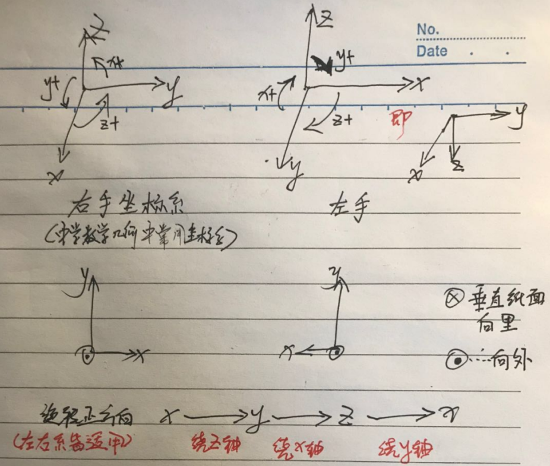
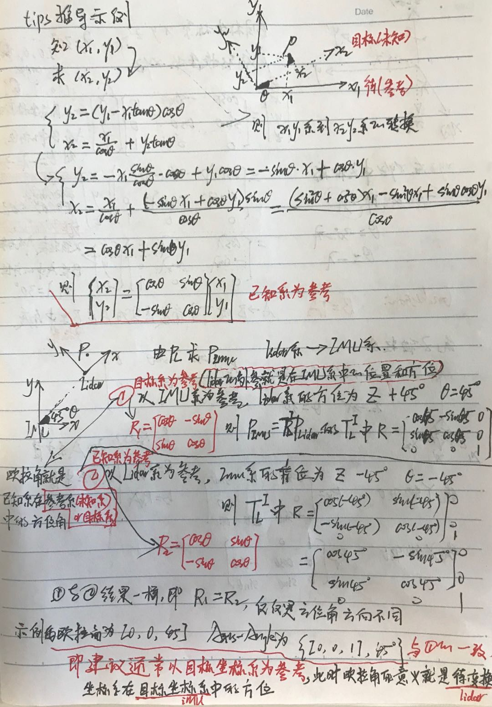
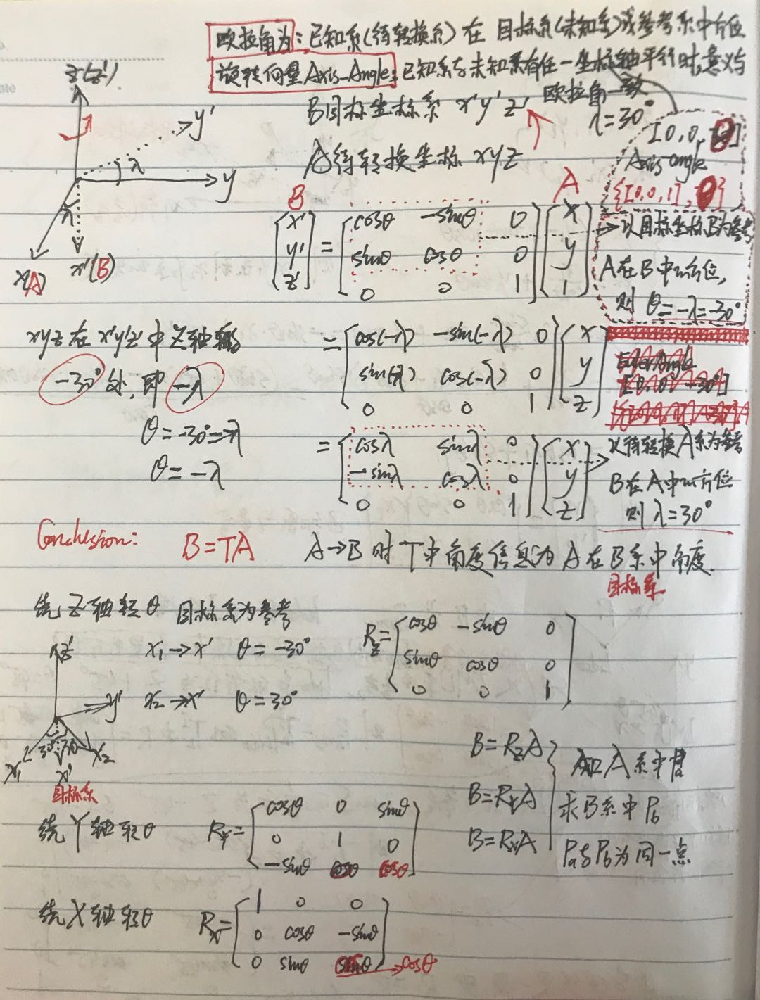
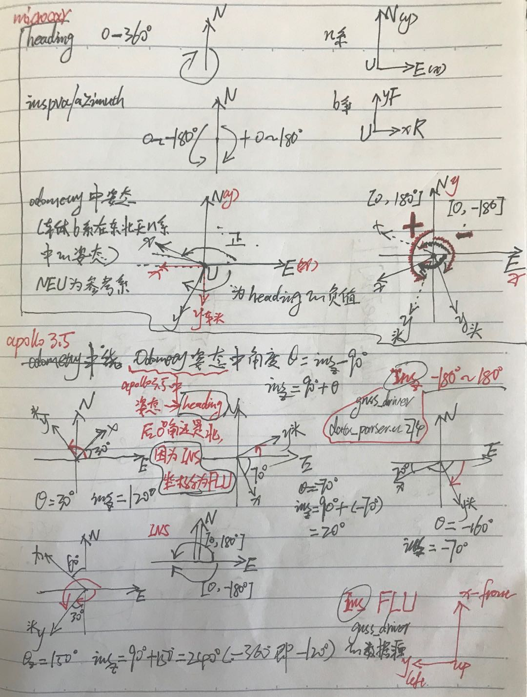

# 刚体运动-三维旋转变换-2020

## case0
```cpp
//P_g = T_g_l * P_l;  T_g_l is l/g transform
Eigen::Vector3d point_curr(pi->x, pi->y, pi->z);//lidar系点云
//q_w_curr_ t_w_curr_为lidar在goal坐标系下的坐标,即变换关系
Eigen::Vector3d point_w = q_w_curr_ * point_curr + t_w_curr_;//转到global系
```

## case1
```cpp
const Eigen::Affine3d GetRefinedPose() {
  //odom_t_、odom_q_为t时刻scan2scan轨迹
  // correct_q、correct_t为t时刻scan2scan轨迹到精确轨迹的变换关系 
  odom_q_ = correct_q * odom_q_;
  odom_t_ = correct_q * odom_t_ + correct_t;

  Eigen::Affine3d result =
        Eigen::Translation3d(odom_t_.x(), odom_t_.y(), odom_t_.z()) *
        odom_q_.normalized();
  return result;// refined_pose = odom_pose * correct_pose
}

//计算corrected_pose = odom_pose.inverse() * refined_pose
correct_q_ = q_w_curr_ * odom_q_.inverse();
correct_t_ = t_w_curr_ - correct_q_ * odom_t_;
```
## 坐标变换

[OnlinRigidBodyRotationConverter Tool](https://www.andre-gaschler.com/rotationconverter/)

>**欧拉角和旋转向量、旋转矩阵、四元数的对应唯一**

- **欧拉角EulerAngle**对应的**旋转矩阵、四元数**是唯一的，对应的**旋转向量Axis-Angle**有2种可能(与旋转轴正方向有关，但结果一致)。
  如绕Z轴逆向旋转45°旋转向量表示 `{(0,0,1), -45°}={(0,0,-1), 45°}`
- 当已知坐标系和目标坐标系3坐标轴有任一坐标轴平行时，欧拉角和旋转向量的表示相差无几
- 反之**旋转矩阵**和**四元数**、**Axis-Angled**对应2种**Euler-Angle**(与旋转方向有关,**一般使用角度不超过180°**，结果也一致)。
  ```bash
  ##### case1
  (x,y,z)=(0, 0, -180.1°)=(0, 0, 179.9°) #绕z旋转179.9°
  (x,y,z)=(0, 0, 180.1°)=(0, 0, -179.9°) #绕z旋转180.1°
  
  ##### case2, 绕z轴正向旋转60°, 坐标系为右手坐标系XYZ(degree) 
  (x,y,z)=(0, 0, 60°)=(0, 0, -300°) #等同于旋转向量{(0,0,1), 60°}或{(0,0,-1), -60°}
  ```
  
 
		
## 左手、右手法则
**判断左手、右手坐标系旋转正方向**


- 左手坐标系:左手(x-大拇指、y-食指、z-中指)
  >对左手坐标系，确定一个旋转轴后，左手握住拳头，拇指指向旋转轴的正方向，四指弯曲的方向为旋转的正方向。

- 右手坐标系:右手(x-大拇指、y-食指、z-中指)
  >右手坐标系就用右手来判定。确定了旋转的正方向后，在公式计算中就很容易知道是该使用正角度还是负角度了


 
 
  

## 左乘变换
**同一个目标在不同坐标系下的坐标变换，如点云从lidar系到imu系的变换是左乘lidar外参 或者 经典的同一点在不同的二维坐标系下的坐标转换(后面有手推过程)**

>如pcl和ndt的初值和配准的结果为:source(相当于 `t1|lidar`)在target(相当于 `t2|imu`)中的坐标，因此source(`t1|lidar`)变换到target(`t2|imu`)时左乘变换

即**A的逆乘以B->B相对A的pose, B左乘该pose转换到 `A系`**

$$
  \text{source在target中的坐标: }\quad T^{target}_{source} = t^{-1}_{target}*t_{source} 
$$
  
$$
  t1时刻位置在t2时刻坐标系中坐标(即t1相对t2的的pose): T^{2}_{1} = t^{-1}_{2}*t_{1}
$$


>`source点云`|`lidar点云`|`t1时刻位置` **在** `target系`|`imu系`|`t2系中的坐标`:
  
$$
  t_{NsCloud|Nlidar|Nt_1} = T^{target|imu|t2}_{source|lidar|t1} \cdot t_{source|lidar|t_1}
$$

 

## 右乘变换
  **在同一个坐标系下，不同目标或者同一目标在不同时刻位姿的转换，如world系下由imu的world坐标推lidar的world坐标，或者world系下由车在某时刻world坐标推另一时刻的world坐标**

>当前时刻$t_2$在前一时刻$t_1$中的坐标$T^1_2$

即**A的逆乘以B->B相对A的pose, B右乘该pose转换到 `和A同处的坐标系`**

$$
  2时刻位置在t1时刻坐标系中坐标(即t2相对t1的pose):T^1_2 = t^{-1}_1 \cdot t_2
$$

>知道$t_1$的pose($t_1$相对全局坐标系)`和`$t_2$相对$t_1$的pose

$$
  2的pose(t2相对全局坐标系):t_2 = t_1 \cdot T^1_2
$$

>case: imu / lidar / global坐标系之间的转换
 

- imu在世界坐标系中位姿 : $P_{imu}$ 
- lidar在imu坐标系中位姿：$T^i_ {l}$ 
- lidar在世界坐标系中位姿：$P_{l}$ = $P_{imu}$$\times$$T^i_ {l}$ 
- imu在lidar坐标系中位姿：$T^l_ {i}$=$T^{i-1}_ {l}$ 
- imu在世界坐标系中位姿：$P_{imu}$ = $P_{l}$$\times$$T^{i-1}_ {l}$

也就是：

- $t_1$时刻车在world系中位姿为： $P_1$，$t_2$时刻车在world系中位姿为： $P_2 = P_1 \times T^1_2$
- $t_2$时刻车体系在$t_1$时刻车体系中的位姿为：$T^1_2 = P_1^{-1} \cdot P_2$，**即所谓上一时刻的逆右乘当前时刻=当前时刻b系在上一时刻b系中的位姿**  


## 左乘变换参考系的选取
>参考系的选取主要是便于理解欧拉角以确定旋转矩阵或四元数

- 如果以待求坐标系(即未知系、目标系)为参考系，欧拉角即为已知系(即待变换系)在参考系中的方位，所以**通常以目标系为参考**
- 如果以已知系(即待变换系)为参考系，欧拉角和待求坐标系(即未知系、目标系)在参考系中的方位相反！！！
- 以哪个坐标系为参考(一般以目标系为参考系，如东北天->body,顺时针为正)，主要是为了便于理解直观的从EulerAngle或者Axis-Angle的角度理解三维变换，不管以哪个为参考最终的变换都是唯一的
- **以目标系为参考的更加常见(在目标系中的pose, 如yaw就是相对东北天的)，**

$$
  \begin{bmatrix}
  x_{enu} \\
  y_{enu}
  \end{bmatrix} 
  = \begin{bmatrix} 
  cos(yaw), &-sin(yaw) \\
  sin(yaw),&cos(yaw)
  \end{bmatrix} 
  \begin{bmatrix}
  x_{vcs}\\
  y_{vcs}
  \end{bmatrix}
$$ 

 
  

## gnss-driver中inspva-odometry绕z轴角度

- inspva/azimuth  左手系(顺时针0~180 和 -180~0)
- odometry中yaw角则转为右手系(逆时针0~180 和 -180~0)

 