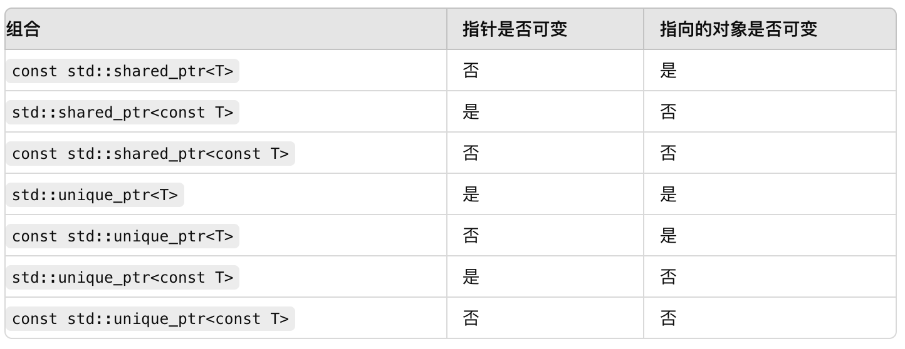
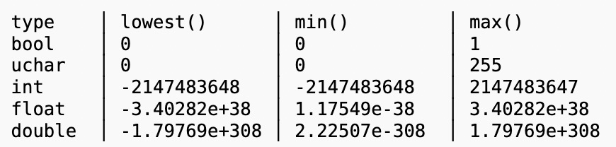

# C++ Tips and Tricks

## 摘录tips

>If your home is clean, most guests will be clean without being asked. 我想不光文档如是，在我们的实践中，如果各团队各模块都能做到代码洁净清晰，所有人都会自觉地同样做到。反之，似乎就会恶性循环。永远将最好的产出交给下一环，是应当追求的文化，与大家共勉 https://google.github.io/styleguide/docguide/best_practices.html

[**coding stype of Drake(google style加强)**](https://drake.mit.edu/styleguide/cppguide.html)


## const

[absel-tips-109: function const](https://abseil.io/tips/109)
修饰对象是啥？

```cpp
//如果const位于*的左侧，则const就是用来修饰指针所指向的变量，即指针指向为常量；
//如果const位于*的右侧，const就是修饰指针本身，即指针本身是常量
 

int i = 42;
int *p;      //p是一个未初始化的只想int对象的指针
int *&r = p; //r是一个指向int型指针的引用，(离变量名最近的符号（此处是&）决定变量的类型，所以此处r肯定是一个引用)
r = &i;      //相当于指针p指向i, 即p = &i

```
**const和智能指针组合**


 
## 位运算(bit opertion)

**基础定义**

位运算非常简单，非常容易理解而且很有趣，在平时的开发中应用也非常广泛，特别是需要优化的大数据量场景。所使用的编程语言的`+-*/`运算符实际上底层也都是用位运算实现的。在面试中如果你能用位运算优化程序、进行集合操作是不是也能加分呀。花费很少的时间就能带来很大的收获何乐而不为。本文总结了位运算的基本操作、常用技巧和场景实践，希望能给你带来收获。


**常见表示**

| 16进制Hexadecimal<br />以0x开头(x不分大小写,number zero), 0x与0X等价 | 8进制Octal<br />以0开头(number zero) | 2进制Binary | 10进制Decimal |
| :------------------------------------------------------------------- | ------------------------------------ | ----------- | ------------- |
| 0xF                                                                  | 017<br />转binary: 7x8^0+1x8^1       | 1111        | 15            |
| 0xFF                                                                 |                                      | 1111-1111   | 255           |


### 负数的二进制表示

**二进制最后一位为0则为偶数，为1则为奇数**

```
e.g: -5的二进制表示
0000 0101 //5的二进制 原码
1111 1010 //取反      反码
1111 1011 //反码+1    补码，即为-5的二进制表示（8位）
1111 1111 1111 1011 //-5的二进制表示（16位）
e.g: 知道某负数的二进制表示为 11110011 = -13
1111 0011 //某负数二进制表示
1111 0010 //减1
0000 1101 //取反，即为十进制的13
```


### 常见位运算(bit opertion)


**常见的位运算主要有6个**

>按位与、按位或、左移<、右移>、按位取反、按位异或、逻辑右移

```
1 PB = 1024 TB
1 TB = 1024 GB
1 GB = 1024 MB
1 MB = 1024 KB
1 KB = 1024 B(Byte 字节)
1 B  = 8    bit(位，也称比特计算机内存基本单元)


原码：二进制表示（注意，有一位符号位）
反码：正数的反码就是原码，负数的反码就是符号位不变，其余为都取反
补码：正数的补码就是原码，负数的补码是反码+1
符号位：最高位为符号位，0表示正数，1表示负数。在位运算中符号位也参与运算
```

**按位与**

`二目运算符，两位都为1结果为1，其他情况为0`

```
1 & 1 = 1
1 & 0 = 0
0 & 1 = 0
0 & 0 = 0
e.g: 3 & 17 = 1
3 = 00000011 //011, 二进制不足的为用0补
17= 00010001
& = 00000001 = 1
```

**按位或**

`二目运算符，有一位为1结果为1，两位都为0结果才为0`

```
1 & 1 = 1
1 & 0 = 1
0 & 1 = 1
0 & 0 = 0
e.g: 3 | 17 = 19
3 = 00000011 //011, 二进制不足的为用0补
17= 00010001
| = 00010011 = 19
```

**按位异或**(一样为0,不一样为1)

`二目运算符，都为1或都为0则结果为0，否则为1`

```
0 ^ 0 = 0
1 ^ 1 = 0
1 ^ 0 = 1
0 ^ 1 = 1

7 ^ 1 = 6 #奇数异或1，结果为左边的偶数(-1)
0111->7
0001->1
0110=6
6 ^ 1 = 7 #偶数异或1，结果为右边的奇数(+1)
0110->6
0001->1
0111=7
```

**按位取反**

`单目运算符，对操作数进行按位取反`

```
#无论正数、负数或0，均为取反然后-1
～20 = -20 - 1 = -21
...
～1 = -1-1= -2
～0 = -0 - 1 = -1
～-1 = 1-1 = 0
～-2 = 2-1 = 1
...
～-20 = 20 - 1 = 19
##e.g [-5, 5] 均取反则为 [-6, 4]
```

**左移操作**

`二目运算符，把操作数整体向左移动`

```
e.g: 33<<2 = 100001<<2 = 10000100 = 132
-2147483647 << 1 = 10000000000000000000000000000001 << 1 = 10 = 2 (符号位也参与运算)
技巧：a << n = a*2^n （a为正数）
```

**右移操作**

`二目运算符，把操作数整体向右移动，左侧不足的补符号位的数（正数0，负数1），右侧超出的位截掉`

```
对于算术右移，原来是负数的，结果还是负数，原来是正数的结果还是正数。逻辑右移将A的二进制表示的每一位向右移B位，右边超出的位截掉，左边不足的位补0。所以对于逻辑右移，结果将会是一个正数

e.g: 
-2147483647 >> 1 = 10000000000000000000000000000001 >> 1 
= 01000000000000000000000000000000 = 1073741824 （补足0）
技巧：a>>n = a/2^n
```

### 使用场景及示例

#### 判断奇偶(按位与)

**位运算效率远高于乘除和求于运算**

>使用按位与（AND）运算可以判断一个整数是奇数还是偶数。对于任意整数n，其二进制表示的最低位（LSB）表示n的奇偶性：如果最低位是0，则n是偶数；如果最低位是1，则n是奇数。

```cpp
func_is_odd = [](int exp){
  return (exp & 0x01) ? true : false;  //奇数odd, 0x01即为十六进制1
  // exp & 0x01 同 0x01 & exp 一样
};
``` 

#### 交换两个变量的值
>使用按位异或（XOR）运算可以交换两个变量的值。对于任意整数a和b，其二进制表示的最低位（LSB）表示a和b的不同位：如果最低位是0，则a和b的对应位相同；如果最低位是1，则a和b的对应位不同。

```cpp
func_swap = [](int& a, int& b){
  //a = 5, b = 7
  a = a ^ b;
  b = a ^ b; // 现在 b 是 5
  a = a ^ b; // 现在 a 是 7
}; 
```


#### 错误码设置和判断
```cpp
error_code[Error::kBev] |= (1 << Error::kNoMessage);

if(CHECK_BIT(error_code[Error::kBev], Error::kNoMessage)){
  //...
}

#define CHECK_BIT(data, bit) (((data) & (1LL << (bit))) != 0)
#define CLEAR_BIT(data, bit) ((data) &= (0LL << (bit)))
#define SET_BIT(data, bit) ((data) |= (1LL << (bit)))
#define CLEAR_BITS(data) ((data) = (0))
```

#### 存储坐标

>按位或和左移结合使用: 存储数据

>按位与和右移结合使用: 取数据

**case1: patch_id和pixel_id的存储**

```cpp
64 pixel.x 48  pixel.y 32 patch.x  16  patch.y   0
存 (x+1)<<48    y<<32      x<<16
取 (id>>48)-1 (id>>32)&0xFFFF
|...........|...........|............|............|  

using PatchId = uint64_t;
using PixelId = uint64_t; //同时包含pixel和patch的坐标
struct PixelRowCol {
  int row;
  int col;
  bool operator==(const PixelRowCol& rhs) const {
    return row == rhs.row && col == rhs.col;
  }
};  
```

```cpp

static constexpr int kPatchRowBitOffset = 16;

static constexpr int kPixelColBitOffset = 32;
static constexpr int kPixelRowBitOffset = 48;

static constexpr uint64_t kPatchIdMask = 0xFFFFFFFF; //头32位段
static constexpr uint64_t kPixelIdMask = 0xFFFFFFFF00000000;

uint64_t PatchRowColToId(int16_t row, int16_t col){
    uint64_t key_row = *reinterpret_cast<uint16_t*>(&row);
    uint64_t key_col = *reinterpret_cast<uint16_t*>(&col);
    //return (key_row << kPatchRowBitOffset) | key_col;
    return (key_row << 16) | key_col;
}
////////
uint64_t PixelRowColToId(int16_t row, int16_t col){
    uint64_t patch_id= ....

    uint64_t pix_row = *reinterpret_cast<uint16_t*>(&row);
    uint64_t pix_col = *reinterpret_cast<uint16_t*>(&col);
    return ((pix_row + 1) << 48) | (pix_col << 32) | patch_id;
}

PixelRowCol PixelIdToRowCol(uint64_t pixel_id){
    return {static_cast<int>(pixel_id >> 48) - 1,/*pixel_x*/
          static_cast<int>(pixel_id >> 32) & 0xFFFF /*只保留尾端16位的pixel.y, 16进制F表示二进制1111*/}
}
uint64_t GetBelongingPatchId(uint64_t pixel_id){
    //取0-64位段中的0-32,即patch_id所处位段
    //return pixel_id & kPatchIdMask;
    return pixel_id & 0xFFFFFFFF; //按位与,只保留后32位段
}
```


**case2: 存储点云数据**


```cpp

using PointIndexer = std::uint32_t;
// constexpr uint32_t kLidarMask = 0xF0000;
// constexpr uint32_t k
// |lidarid-8|scanline_id-8|point_id-16|
/*
uint8 [0,255]
uint16 [0,65535]
uint32 [0,4294967295]
*/

struct PointInfo {
  uint16_t lidar_id; // uint8_t 不输出数字
  uint16_t scanline_id;
  uint16_t point_id;
  PointInfo() = default;
  PointInfo(uint16_t id1, uint16_t id2, uint16_t id3)
      : lidar_id(id1), scanline_id(id2), point_id(id3) {}
  friend std::ostream &operator<<(std::ostream &os, const PointInfo &info) {
    os << "lidar_id:" << info.lidar_id << "  scanline_id:" << info.scanline_id
       << " point_id:" << info.point_id << std::endl;
    return os;
  }
};
PointIndexer GetPointIndexer(const PointInfo info) {
  // uint32_t key_lidar_id = uint32_t(lidar_id);
  return (uint32_t(info.lidar_id) << 24) | (uint32_t(info.scanline_id) << 16) |
         (uint32_t(info.point_id));
}

PointInfo PointIndexerToInfo(const PointIndexer indexer) {
  PointInfo info;
  info.lidar_id = uint16_t(indexer >> 24);
  info.scanline_id = uint16_t((indexer >> 16) & 0xFF);
  info.point_id = uint16_t(indexer & 0xFFFF);
  return info;
}
int main() {
  PointInfo info(0, 0, 0);
  PointIndexer indexer = GetPointIndexer(info);
  std::cout << "indexer:" << indexer << std::endl;
  std::cout << "recover indexer:  " << PointIndexerToInfo(indexer) << std::endl;

  PointInfo info2(5, 40, 65533);
  PointIndexer indexer2 = GetPointIndexer(info2);
  std::cout << "indexer2:" << indexer2 << std::endl;
  std::cout << "recover indexer2:  " << PointIndexerToInfo(indexer2)
            << std::endl;
  return 0;
}
```

## 模版相关

### using声明模板别名

> typedef 不能用于模板别名，而 using 可以 


```cpp
template<typename Key, typename T>
using FlatHashMap = absl::flat_hash_map<Key, T>;

template<typename T>
using PatchId = uint64_t;
using FlatHashSet = absl::flat_hash_set<T>;
using PatchIds = FlatHashSet<PatchId>;
//usage
FlatHashMap<int, std::vector<int>> key_submapids;

```

## 数据类型

### 基本类型

**字符串**

- `std::stringstream`
```cpp
std::string msg;
std::stringstream ss;  //#include<sstream>
ss<<"hello world!";
msg = ss.str();        //stringstream->string,而c_str()将string转为C串
```

**数值型**

- int8和uint8默认表示字符，输出的话不会输出对应的数字(**需要如下如下转换才能显示数字**)

  ```cpp
    std::vector<int8_t/*uint8_t*/> test = {0, 1, 2, 3, 4, 'c', 5, 6, 40};
    for (const auto ele : test) { 
      std::cout << unsigned(ele) << " ";//通过unsigned转为数值型
    }
    std::cout<<"xxx show num of 'a':"<<unsigned('a'); //'a'的ASCLL对应数字97
  ```

- `unsigned char`和`uint8_t`一样，都是8位，`uint8_t`更加健壮(**使用int8或者uint8_t表示数字，输出时需要转换为数值**)
- `size_t`在32位机器 `typedef unsigned int size_t;`，在64位机器为 `typedef  unsigned long size_t`
- `uint8`:  [0,255]. `uint16`: [0,65535]. `uint32`: [0,4294967295]
- `char`: is neither `unsigned char` nor `signed char`
- `int`: is implicitly `signed int`

常见数据类型

| 变量                                                                      | 值                                                                                                                                                                                                                                                                                               |
| ------------------------------------------------------------------------- | ------------------------------------------------------------------------------------------------------------------------------------------------------------------------------------------------------------------------------------------------------------------------------------------------ |
| FLT_MIN  <br /> `Defined in header <cfloat>`                              | **无限接近0，但大于0**                                                                                                                                                                                                                                                                           |
| FLT_MAX                                                                   | >0的极大值                                                                                                                                                                                                                                                                                       |
| INT_MIN    <br /> `Defined in header <climits>`                           | <0的极大值                                                                                                                                                                                                                                                                                       |
| INT_MAX                                                                   | >0的极大值                                                                                                                                                                                                                                                                                       |
| $\mathbf{std::numeric\_limits<T>::}$  <br /> `Defined in header <limits>` | $\mathbf{max()}$: >0的极大值<br />$\mathbf{lowest()}$ : int float double  <0的极大值<br />$\mathbf{min()}$: int类型 <0的极大值<br />$\mathbf{min()}$: **float和double类型 都是>0的极小值** <br />$\mathbf{epsilon()}$: int为0,double、float为>0的极小值 <br />$\mathbf{quiet\_NaN()}$: 值为`nan` |

[std::numeric_limits](https://en.cppreference.com/w/cpp/types/numeric_limits)



> NaN值(Not a Number)是指非数值，是浮点数运算中表示无效结果的特殊值。

- 非法计算可能产生NaN值，如0/0、sqrt(-1)、log(0)等。
- NaN 与其他任何值相比，结果都是false, 包括NaN本身。
- NaN作为结果无法插入关联容器中
  ```cpp
  std::set<double> test;
  test.insert(NaNvalue); //存在Nan后无法再向集合中插入任何值
  test.insert(1.0); // 存在Nan,导致不会插入 
  test.insert(2.0); // 不会插入
  ```

- 创建并判断NaN值

  ```cpp
  #include <cmath>
  #include <iostream>
  #include <limits>
  int main() {
    
    float nan_v1 = std::nanf(""); // create a NaN value
    float nan_v2 = std::numeric_limits<double>::quiet_NaN();// create a NaN value
    if (std::isnan(nan_v1)) { //true
      std::cout << "nan_v1 is NaN" << std::endl;
    } 
    if (std::isnan(nan_v2)) { //true
      std::cout << "nan_v1 is NaN" << std::endl;
    }
    std::cout<<" isfinite(nan):"<<std::isfinite(nan_v2)<<std::endl; //false
    std::cout<<" isfinite(1):"<<std::isfinite(1.0)<<std::endl; //true
    return 0;
  }
  ```

**不仅检查一个数字是否为 NaN，还应该进行更全面的检查——判断数字是否有限，`std::isfinite`。**


### array

>初始化时如果分配的空间比较大位于**栈区**

- **栈溢出**：`std::array`定义的数组在初始化时如果分配的空间比较大(位于栈区)，很容易存在`Stack smashing`的问题,如`std::array<std::array<Cell 200>, 800> polar_data{}`存造成栈区溢出引起程序诡异的偶发中断，且排查无明显线索 

- **解决方法**： 避免在栈区分配较大的空间，最好使用new操作符在堆空间申请内存
 
### push_back和emplace_back
- push_back: 插入对象时候会执行拷贝构造或移动构造，它会将对象复制或移动到容器中,调用 push_back 时，会有一个已经构造好的对象，容器再为它调用 拷贝构造函数 或 移动构造函数
  ```cpp
  #include <iostream>
  #include <vector>
  
  class MyClass {
  public:
      MyClass(int x) { std::cout << "Constructor called with " << x << std::endl; }
      MyClass(const MyClass& other) { std::cout << "Copy constructor called" << std::endl; }
      MyClass(MyClass&& other) { std::cout << "Move constructor called" << std::endl; }
  };
  
  int main() {
      std::vector<MyClass> vec;
      MyClass obj(10);
      vec.push_back(obj);   // Copy constructor is called
      vec.push_back(MyClass(20)); //临时对象触发移动构造被调用(if MyClass supports move semantics)
  }
  ```
- emplace_back: 与push_back类似，但是它不会拷贝或移动对象，而是直接构造对象，这样可以避免构造和拷贝的开销，提高效率。
  ```cpp
  #include <iostream>
  #include <vector>
  
  class MyClass {
  public:
      MyClass(int x) { std::cout << "Constructor called with " << x << std::endl; }
      MyClass(const MyClass& other) { std::cout << "Copy constructor called" << std::endl; }
      MyClass(MyClass&& other) { std::cout << "Move constructor called" << std::endl; }
  };
  
  int main() {
      std::vector<MyClass> vec;
      vec.emplace_back(30);  // Constructor is called directly with 30, no copy or move involved
  }
  ```

### enum和enum class
 

>在C++11及以后的版本中，推荐使用enum class,定义的枚举类型默认是整型，可以避免隐式转换错误,提供了更好的类型安全性和更清晰的代码。然而，enum在一些需要与旧代码兼容或需要枚举值具有整数底层类型的情况下仍然有其用途。


**作用域:**

- enum class 具有限定作用域。这意味着枚举类中的枚举值是限定在类内部的，外部代码不能直接访问枚举值，需要使用类名作为前缀
  ```cpp
  enum class Color : int { Red, Green, Blue };
  int main() {
      // Color::Red; // 正确
      // Red; // 错误，未定义的标识符
      return 0;
  }
  ```
- enum（未指定class的枚举）具有全局作用域。枚举值默认是外部作用域的一部分，除非它们被限定在枚举定义中
  ```cpp
  enum Color { Red, Green, Blue };
  int main() {
      Color c = Red; // 正确，Red是全局可见的
      return 0;
  }
  ```

**类型安全:**

- enum class 提供更好的类型安全。不同的enum class类型甚至是枚举值相同的，也被视为不同的类型。
- enum在默认情况下它们的值是整数，并且可以隐式转换为整数，这可能导致类型不安全的情况

**与整数的兼容性:**

- enum class 不能隐式地转换为整数类型，这避免了一些潜在的类型错误。
- enum的值可以隐式地转换为整数，这在某些情况下可能导致不希望的类型转换。

**大小:**

- enum class 不允许隐式的大小定义，它们的大小由底层类型明确指出（如果未指定，则由编译器决定）。
  ```cpp
  enum class Color : uint8_t { Red, Green, Blue };
  ```
- enum的大小由编译器决定，通常为最小的足以容纳所有枚举值的整数类型

**前向声明：**

- enum class 不支持前向声明。
- enum可以被前向声明，这在需要在多个文件中使用枚举类型时非常有用。

**重载决策：**

- 当使用enum class时，编译器在重载函数时能够区分不同的枚举类型，即使它们的底层表示相同。
- 使用enum时，由于枚举值最终是整数，编译器在重载决策时可能会遇到歧义。

**标准支持：**

enum class是在C++11中引入的，它提供了一种更现代和类型安全的方式来定义枚举。


### 组合类型(pair&tuple)

| 操作函数                                                 | 描述                                                                                 |
| :------------------------------------------------------- | :----------------------------------------------------------------------------------- |
| **std::pair<T1, T2> var**<br />std::pair位于 `<utility>` | Default构造函数建立一个pair，其元素分别为T1和T2，各自以其default构造函数初始化       |
| var.first                                                | 获取pair内第一value(直接成员访问)                                                    |
| var.second                                               | 获取pair内第二value(直接成员访问)                                                    |
| std::get<0>(var)                                         | 等价于var.first(C++11)                                                               |
| std::get<1>(var)                                         | 等价于var.second(C++11)                                                              |
| **std::tuple<T1,T2,....>**<br />位于 `<tuple>`           | 以n个给定类型的元素建立一个tuple，以各自类型default构造函数初始化(基础类型初值都为0) |

```cpp
std::string s;
auto x = std::make_tuple(s); //x is of type tuple<string>

auto y = std::make_tuple(ref(s)); //y is of type tuple<string&>,thus y refer to s
std::get<0>(y) = "my value";      //both y and s is "my value"

//重载ostream，直接输出pair tuple等类型数据
//output operator for tuples
#include <tuple>
#include <iostream>
//hepler: print element with index IDX of tuple with MAX elements
template <int IDX, int MAX, typename... Args>
struct PRINT_TUPLE {
  static void print (std::ostream& strm, const std::tuple<Args...>& t) {
    strm << std::get<IDX>(t) << (IDX+1 == MAX ? "" : ",");
    PRINT_TUPLE<IDX+1, MAX, Args...>::print(strm, t);
  }
};

//paritial sepcilization to end the recursion
template <int MAX, typename... Args>
struct PRINT_TUPLE<MAX, MAX, Args...> {
  static void print (std::ostream& strm, const std::tuple<Args...>& t) {
  }
};
//output operator for tuples
template <typename... Args>
std::ostream& operator << (std::ostream& strm, const std::tuple<Args...>& t) {
  strm <<"[";
  PRINT_TUPLE<0, sizeof...(Args), Args...>::print(strm, t);
  return strm <<"]";
}
```

### 标准库usage

| usage                        | function                                                                 | example                                                  |
| ---------------------------- | ------------------------------------------------------------------------ | :------------------------------------------------------- |
| std::optional                | 可选变量                                                                 | `std::optional<int> id; //default value is std::nullopt` |
| std::distance                | 返回两个迭代器之间的距离                                                 |                                                          |
| std::lower_bound             | 查找容器中第一个大于等于xx的元素并返回其迭代器                           |                                                          |
| std::upper_bound             | 查找容器中第一个大于xx的元素并返回其迭代器                               |                                                          |
| std::clamp(value, kMin,kMax) | value介于[kMin,kMax]时候返回value,value<kMin返回kMin, value>kMax返回kMax |                                                          |
 


## 常用容器

### hash容器
>std::unordered_map, std::unordered_set, std::unordered_multimap, std::unordered_multiset

#### hash函数
>hash值一样冲突的话非常影响效率，不一定要使用位运算，其他能生成唯一index的都可以

**实例**

  ```cpp
  //std::pair as key ----from apollo
  struct PairHash {
    template <typename T, typename U>
    size_t operator()(const std::pair<T, U>& pair){
      //pair的x y的值有正有负的时候，使用该方法会造成hash冲突,解决冲突需要大量时间
      //该hash func造成poleExtractor是用时竟然超过100ms,而使用下面的hash-func则为2ms
      //return std::hash<T>()(pair.first) ^ std::hash<U>()(pair.second);
      //max类型最大值要小于pair.x()的类型,否则会存在溢出
      return std::numeric_limits<uint16_t>::max() * pair.x() + pair.y();
    }
  };
  //e.g
  std::unordered_map<std::pair<std::string, std::string>, 
              std::string, PairHash> var;

  //voxel vec3i as key
  struct VoxelHash {
    size_t operator()(const Voxel& rhs) const {
      //rhs的x y z的值有正有负的时候，使用该方法会造成hash冲突,今儿解决冲突需要大量时间
      //如使用该hash func造成pole extractor是用时竟然超过1000ms,而使用下面的hash-func则为15ms
      auto xy_hash =
          (std::hash<int>(rhs.x()) ^ (std::hash<int>(rhs.y()) << 1)) >> 1;
      return (xy_hash ^ (std::hash<int>(rhs.z()) << 1)) >> 1;
      /*or
      const size_t kP1 = 73856093;
      const size_t kP2 = 19349669;
      const size_t kP3 = 83492791;
      return vox.x * kP1 + vox.y * kP2 + vox.z * kP3;
      ////or
      return std::numeric_limits<uint16_t>::max() * rhs.x() + rhs.y() + rhs.z();
      */
    }
  };

  //struct as key
  struct MyKey{
    int id;
    std::string name;
    std::string uuid;
    bool operator==(const MyKey& rhs)const {
      reutrn (id == rhs.id && name == rhs.name && uuid == rhs.uuid);
    }
  };
  struct MyKeyHash{
    std::size_t operator()(const MyKey& key)const {
      return ((std::hash<std::string>()(key.name) ^ 
              (std::hash<std::string>()(key.uuid << 1)))   >> 1) ^ 
            (std::hash<int>()(key.id)<<1);
    }
  };
  //e.g
  std::unordered_map<MyKey, int, MyKeyHash> var;
  ```
**使用时资源/性能考量**

>合理选择哈希函数：哈希函数的质量直接影响到 std::unordered_map 的性能和空间占用。选择一个**均匀分布的哈希函数可以减少哈希冲突，提高性能**。C++ 标准库提供了一些内置的哈希函数，但如果可能的话，你也可以自定义哈希函数以满足特定需求。

合理分配和管理 `std::unordered_map` 的资源以提高性能并控制空间占用，你可以通过以下步骤进行：

- 预估元素数量：首先，根据你的应用场景和需求，预估将要存储在 `std::unordered_map` 中的元素数量。

- 选择桶的数量：`std::unordered_map` 内部使用桶（buckets）来存储元素，桶的数量直接影响到哈希表的性能和空间占用。一般情况下，选择桶的数量为元素数量的 1.5 倍左右能够提供较好的性能。可以使用 `reserve` 函数预留桶的数量，或者在创建容器时指定桶的数量。 

- 控制负载因子：负载因子（load factor）表示哈希表中已存储元素的比例。默认情况下，负载因子的阈值为 1.0，即当元素数量达到桶的数量时会触发自动 rehash 操作。你可以通过调用 `max_load_factor` 函数设置较小的负载因子阈值，例如 0.5，以减少冲突和提高性能。 


- 适当分配内存：`std::unordered_map` 内部会根据元素数量和桶的数量动态分配内存。当预估的元素数量较大时，你可以考虑使用 `reserve` 函数预先分配足够的内存空间，以避免频繁的内存重新分配。 


- 选择合适的哈希函数：`std::unordered_map` 使用键的哈希值来决定元素在桶中的位置。选择一个良好的哈希函数可以减少哈希冲突，提高性能。C++ 标准库提供了一些内置的哈希函数，但对于特定的键类型，你也可以自定义哈希函数以满足需求。 


- 避免频繁的插入和删除操作：频繁的插入和删除操作可能会导致 `std::unordered_map` 频繁地进行 rehash 操作，影响性能。如果可能的话，尽量一次性插入或删除元素，以减少这种操作的次数。 

### hash_map vs map

>`std::map` 和 `std::unordered_map` 是 C++ 标准库中的两个关联容器，它们具有不同的实现和特点，适用于不同的使用场景。

####  **std::map**
 
- **底层实现：**`std::map` 是基于红黑树（Red-Black Tree）实现的有序关联容器。它将键值对存储为按键排序的一系列节点，每个节点包含一个键和一个关联的值。
   
- **排序性：**`std::map` 中的键值对按照键的自然顺序进行排序。在插入和删除操作后，它会自动保持元素的有序性。

- **查找效率：**查找操作的时间复杂度为 O(log n)，其中 n 是元素的数量。

- **使用场景：**适用于需要按键排序和有序访问的场景，例如需要按键范围遍历元素、按键进行范围查找等。 

#### **std::unordered_map**
   
   - **底层实现：**`std::unordered_map` 是基于哈希表（Hash Table）实现的无序关联容器。它使用键的哈希值将键值对存储到不同的桶（bucket）中。
   - **无序性：**`std::unordered_map` 中的键值对没有特定的顺序，插入和删除操作不会改变元素的相对顺序。
   - **查找效率：**平均情况下，查找操作的时间复杂度为 O(1)，最坏情况下为 O(n)，其中 n 是桶的数量。哈希表的性能主要依赖于哈希函数的质量和桶的数量。
   - **使用场景：**适用于快速查找和插入元素的场景，不关心元素的顺序，例如需要快速查找某个键对应的值、需要高效地插入大量元素等。

>使用场景的选择取决于具体需求：

- 如果你需要按键排序和有序访问元素，或者需要按范围进行遍历和查找，`std::map` 是一个更合适的选择。
- 如果你更关心快速的插入和查找操作，不需要保持元素的有序性，或者你有一个良好的哈希函数并且需要高效地插入大量元素，那么 `std::unordered_map` 是一个更好的选择。

需要注意的是，`std::unordered_map` 的性能优势在于平均情况下的快速查找和插入，但在最坏情况下，特别是当哈希冲突较多时，性能可能会下降。此外，由于 `std::unordered_map` 是无序的，不适合于需要按键的特定顺序进行访问的情况。

## 智能指针

`于头文件<memory>`

- `shared_ptr`实现共享拥有(shared ownership)，标准库还提供了`weak_ptr  bad_weak_ptr`和`enable_shared_from_this`等辅助类; `shared_ptr`和`weak_ptr`内部需额外的辅助对象(引用计数器等)，因此无法完成一些优化操作
- `unique_ptr`实现独占式拥有(exclusive ownership/strict ownership); `unique_ptr`不需要这些额外的开销(`unique_ptr`特殊的构造和析构、copy语义的消除)，`unique_ptr`消耗的内存和native pointer相同，还可使用function object(包括lambda)作为deleter达成最佳优化，甚至零开销。
- smart pointer并不保证线程安全，虽然它有适用某些保证。

### share_ptr

#### 潜在的循环引用问题

>在使用过程中相互指向将会引起循环引用,使得引用计数失效从而导致内存泄漏

```cpp
class B;
class A{
  public:
   std::shared_ptr<B> b_ptr;
   ~A(){ std::cout<<"A is delete!"<<std::endl; }
};
class B{
  public:
   std::shared_ptr<A> a_ptr;
   ~B(){ std::cout<<"B is delete!"<<std::endl; }
};
int main(){
  {
    std::shared_ptr<A> ap(new A);
    std::shared_ptr<B> bp(new B);
    ap->b_ptr = bp;
    bp->a_ptr = ap;//ap / bp引用计数都为2
  }//退出作用域, ap/bp引用计数都为1，并没有减为0
  std::cout<<"main leave"<<std::endl;//循环引用导致ap/bp退出作用域都没有析构
}
```

#### `shared_ptr`基本使用

```cpp
//1. 直接初始化
shared_ptr<string> test(new string("nico"));
shared_ptr<string> test{new string("nico")};

//2. 使用便捷函数make_shared(),快、安全、使用一次分配
shared_ptr<string> test = make_shared<string>("nico");

//3. 先声明,然后赋值(需使用reset(),不能使用赋值运算符)
shared_ptr<string> test;
test = new string("nico");     //Error
test.reset(new string("nico"));//OK

//错误使用
int* p = new int;
std::shared_ptr<int> sp1(p);
std::shared_ptr<int> sp2(p); //Error:two shared pointers manage allocated int
//正确使用
std::shared_ptr<int> sp1(new int);
std::shared_ptr<int> sp2(sp1);
```


#### `shared_ptr`与裸指针或unique_ptr对比

- shared_ptr需要维护ref_count，所以pass by value的时候比裸指针重不少
- 使用shared_ptr的时候很容易产生实质的pass by value而不自知
- sizeof(shared_ptr) == 16，而sizeof(unique_ptr) == 8

#### 线程安全(Thread-Safe)


shared pointer并非线程安全，通常为避免data race须使用如mutex或lock等。但当一个线程修改对象时，其他线程读取其使用次数并不会造成data race,虽然可能读到的值不是最新的。
 

> 指定`deleter`: shared_ptr提供的default deleter调用的是delete,不是deleter[]。因此只有当shared pointer拥有“由new建立的单一对象”，default deleter才适用

```cpp
std::shared_ptr<int> p(new int[10]); //Error,but compiles
std::shared_ptr<int> p(new int[10],  //new[]一个array of object须定义deleter
                       [](int* p) {
                         delete[] p;
                       });
//使用为unique_ptr提供的辅助函数作为deleter(内部调用了delete[])
std::shared_ptr<int> p(new int[10],
                       std::default_delete<int[]>());
```

#### 处理共享内存

```cpp
#include <memory>     //for shared_ptr
#include <sys/mman.h> //for shared memory
#include <fcntl.h>
#include <unistd.h>
#include <cstring>    //for strerror()
#include <cerrno>     //for errno
#include <string>
#include <iostream>
/**
 *@brief 卸除(detach) shared memory 
 */
class SharedMemoryDetacher {
 public:
  void operator() (int* p) {
    std::cout<<"unlink /tmp1234"<<std::endl;
    if (shm_unlink("/tmp1234") != 0) {
      std::cerr<<"OOPS: shm_unlink() failed"<<std::endl;
    }
  }
};
/**
 * @brief 取得并附着(attach) shared memory
 */
std::shared_ptr<int> getSharedIntMemory (int num) {
  void* mem;
  int shmfd = shm_open("/tmp1234", O_CREAT|O_RDWR, S_IRWXU|S_IRWXG);
  if (shmfd < 0) {
    throw std::string(strerror(errno));
  }

  if (ftruncate(shmfd, num*sizeof(int)) == -1) {
    throw std::string(strerror(errno));
  }
  mem = mmap(nullptr, num*sizeof(int), PROT_READ|PROT_WRITE, MAP_SHARED, shmfd, 0);
  if (mem == MAP_FAILED) {
    throw std::string(strerror(errno));
  }

  //SharedMemoryDetacher将在最后一次被使用时调用
//   return std::shared_ptr<int>(static_cast<int*>(mem), SharedMemoryDetacher());
  //使用lambda
  return std::shared_ptr<int>(static_cast<int*>(mem),
                              [](int* p){
                                std::cout<<"unlink /tmp1234 "<<std::endl;
                                if (shm_unlink("/tmp1234") != 0) {
                                  std::cerr<<"OOPS: shm_unlink() failed"<<std::endl;
                                }
                              });
}
int main() {
  //get and attach shared memory for 100 ints
  std::shared_ptr<int> smp(getSharedIntMemory(100));
  
  //init the shared memory
  for (int i = 0; i < 100; ++i) {
    smp.get()[i] = i*42;//通过get()获得被shared_ptr包裹(wrapped)的内部指针
  }

  //deal with shared memory somewhere else

  std::cout<<"<return>"<<std::endl;
  std::cin.get();

  //release shared memory here:
  smp.reset();
  return 0;
}
```

### weak_ptr

#### 描述及示例

**weak_ptr的效率并不高**，实际上可能比直接用shared_ptr还费劲一些。因为每次使用都需要重新构造出一个shared_ptr（这里还额外引入了一次shared_ptr的析构）。不如直接用const raw_pointer -- *from lulu*.

> 下面2种情况shared_ptr将会遇到问题

- cyclic reference(环式指向)。如果两个对象使用shared_ptr互相只想对方，每个对象的use_count()都为1，反而都无法释放。
- 在你“明确的只是想共享但不愿拥有”某对象的情况下。你要的语义是：reference的寿命比其所指对象的寿命更长。

> 而`weak_ptr`的作用就是解决上述问题。

- class wake_ptr允许你“共享但不拥有”对象(use_count()返回的是对象被shared_ptr拥有的次数)，即在最后一个拥有该对象的shared_ptr失去拥有权后，weak_ptr会自动成空(empty)，class weak_ptr只提供“接受一个shared_ptr”的构造函数。
- 不能使用操作符*和->访问weak_ptr指向的对象，而必须另外建立一个shared_ptr,(weak_ptr只能用来创建、复制、赋值weak pointer，以及转换为一个shared pointer或检查自己是否指向某对象)基于下面2个理由
- 在wak pointer之外建立一个shared pointer检查是否存在一个相应的对象。如果不存在，将会抛出异常或。。。
- 当指向的对象正被处理时，shared pointer无法被释放

```cpp
#include <iostream>
#include <string>
#include <vector>
#include <memory>

class Person {
 public:
  std::string name;
  std::shared_ptr<Person> mother;
  std::shared_ptr<Person> father;
//   std::vector<std::shared_ptr<Person>> kids; //出问题，每个Person的析构不会被调用
  std::vector<std::weak_ptr<Person>> kids;//parent到kids为weak_ptr, kids到parent为shared_ptr

  Person(const std::string& n,
         std::shared_ptr<Person> m = nullptr,
         std::shared_ptr<Person> f = nullptr)
      : name(n), mother(m), father(f) {
  }
  ~Person() {
    std::cout<<"delete "<<name<<std::endl;
  }
};
std::shared_ptr<Person> initFamily(const std::string& name) {
  std::shared_ptr<Person> mom(new Person(name+"'s mom"));
  std::shared_ptr<Person> dad(new Person(name+"'s dad"));
  std::shared_ptr<Person> kid(new Person(name, mom, dad));

  mom->kids.push_back(kid);
  dad->kids.push_back(kid); 
  return kid;
}

int main() {
  std::shared_ptr<Person> p = initFamily("nico");
//   p->mother->kids[0]->name;       //Error，weak_ptr不能使用操作符*和->
  if(!p->mother->kids[0].expired()){
    p->mother->kids[0].lock()->name;//正确，通过lock()获得shared_ptr
  }
  std::cout<<"nico's family exists"<<std::endl;
  std::cout<<"- nico is shared "<<p.use_count()<<" times"<<std::endl;
  std::cout<<"- name of 1st kid of nico's mom:"<<p->mother->kids[0]->name<<std::endl;

  p = initFamily("jim");
  std::cout<<"jim's family exists"<<std::endl;
  return 0;
}
```

#### 返回this指针

`std::enable_shared_from_this类里面有一个weak_ptr用来观察this智能指针, 当shared_from_shis()被调用时会调用weak_ptr的lock()方法将所观察的shared_ptr返回`

- 错误做法(不要将this指针作为shared_ptr返回出来，因为this指针本质上是一个裸指针。因此，返回this可能会导致重复析构)

```cpp
class A{
  public:
   A()=default;
   ~A(){ std::cout<<"Destructor A"<<std::endl; }
   std::shared_ptr<A> GetSelf(){ return std::shared_ptr<A>(this); } //error
};
int main() {
    std::shared_ptr<A> sp1(new A);

    //sp1和sp2没有关系,是独立的,将会执行两次析构并导致错误
    std::shared_ptr<A> sp2 = sp1->GetSelf(); 
    return 0;
}
```

- 正确做法(std::enable_shared_from_this)

```cpp
class A : public std::enable_shared_from_this<A> {
 public:
  shared_ptr<A> GetSelf() {
    return shared_from_this();  //内部的weak_ptr将观察的shared_ptr返回
  }
  ~A() { cout << "Destructor A" << endl; }
};
```

#### 常见用法

- weak_ptr在使用前需要检查合法性,`expired()`返回`false`时才有效
- weak_ptr不会引起所共享的shared_ptr的引用计数的变化

```cpp
use_count() //获取当前观察资源的引用计数
expired()   //判断所观察资源是否已经释放

//expired()=false时返回一个指向共享对象的shared_ptr,false则返回一个空shared_ptr
lock() 
```

```cpp
std::weak_ptr<int> wp;
{
  std::shared_ptr<int> sp(new int(1)); //sp.use_count() == 1
  wp = sp; // wp不会引起sp的引用计数的变化, sp.use_count() 还是 1
  std::shared_ptr<int> sp_2 = wp.lock(); 
}//sp和sp_2由于离开作用域,故而其容纳的对象已经被释放, 此刻wp观察的对象为空

//sp_null.use_count() == 0, sp_null为空,在使用前需要使用expired()判断一下
std::shared_ptr<int> sp_null = wp.lock(); 
std::shared_ptr<int> sp_ok;
if(wp.expired()){
  std::cout<<"Observed shared_ptr object is destoried!"<<std::endl;
}else{
  sp_ok = wp.lock();
}
```

### unique_ptr

> C++11起开始提供，是一种在异常发生时可帮助避免资源泄露的smart pointer, 确保一个对象和其相应资源同一时间只被一个pointer拥有。

#### 使用普通指针

> 因为显示获得资源，不与任何对象捆绑，所以必须被明确释放。但程序若在delete前发生异常将导致内存泄漏(资源泄漏),而使用unique_ptr则不论程序正常或异常结束都能够实现自动销毁。

```cpp
/**
*@brief 以new和delete创建和销毁对象
*/
void f() {
  ClassA* ptr = new ClassA; //create an object explicitly
  ...          //perform some operations
  delete ptr;  //clean up(destory the object explicitly)
}

//为避免资源泄露
void f() {
  ClassA* ptr = new ClassA; //create an object explicitly
  try {
    ... //perform some operations
  }
  catch(...) {
    delete ptr;  //clean up
    throw;       //throw the exception
  }
  delete ptr;    //clean up normal
}
```

#### 使用unique_ptr

> 使用*提领(dereference)指向对象，操作符->用来访问成员

```cpp
//初始化
std::unique_ptr<int> ptr = new int; //Error
std::unique_ptr<int> ptr1(new int);  //OK
std::unique_ptr<int> ptr2(ptr1);//Error, unique_ptr不支持copy构造和assignment
std::unique_ptr<int> ptr3(std::move(ptr1));//Ok,ptr1将拥有权移交给ptr3

std::unique_ptr<int> ptr4;
ptr4 = ptr1;           //Error,no possible
ptr4 = std::move(ptr1);//ok,不能共享，但可以转移拥有权

//没有任何2个unique_ptr以同一个pointer作为初值
std::string* sp = new std::string("hello");
std:unique_ptr<std::string> up1(sp);
std:unique_ptr<std::string> up2(sp); //Error:up1 and up2 own same data

std::unique_ptr<int> ptr; //不拥有,即ptr == nullptr和ptr.reset()同样置空
ptr.reset(new int);

//调用release()
std::unique_ptr<std::string> up(new std::string("nico"));
...
//`sp` own "nico" now, `up` lose ownership and `up` only own nullptr
std::string* sp = up.release();//释放所有权
if (up) { ... }                   
if (up != nullptr) { ... }       
if (up.get() != nullptr) { ... }//`get`返回管理的原始指针，但并不释放所有权
```
from book《C++标准库》第5章

## function

### lambda

```cpp
const auto local_infos=[]{};
static LoaclInfos info = local_infos();
auto greet = []() { std::cout << "Hello, World!\n"; };

//带参数和返回值
auto add = [](int a, int b) -> int { return a + b; };

//带参数和返回值, 且捕获外部变量,如捕获`factor`
int factor = 2;
auto multiply = [factor](int a) -> int { return a * factor; };

//捕获方式
int x = 10;
int y = 20;
auto byValue = [x, y]() { ... };//按值捕获,不影响 x,y
auto byValue = [=]() { ... };//按值捕获所有外部变量

auto byRef = [&x, &y]() { ,,, };//按引用捕获
auto byRef = [&]() { ,,, };//按引用捕获所有外部变量

//泛型lambda表达式（C++14 及更高版本）,接受不同类型的参数
auto add = [](auto a, auto b) { return a + b; };
```

### 函数返回

Two Names: It's a Copy

One Name: It's a Move

Zero Names: It's a Temporary

```cpp
std::vector<int> GetSomeInts() {
  std::vector<int> ret = {1, 2, 3, 4};
  return ret;
}

// Just a move: either "ret" or "foo" has the data, but never both at once.
std::vector<int> foo = GetSomeInts();
```

### 可被调用对象

>Callable Object(可调用对象):可被某种方式调用某些函数的对象

#### 类型及示例
- 一个函数，接受额外传入的args作为参数(argument)
- 一个lambda(本质为函数对象)
- 一个函数对象(function object,拥有*operator()*),附带的args被传递作为实参
- 一个指向成员函数的指针，当通过对象调用时*该对象被传递为第一实参(必须为reference或pointer)*，其他实参对应成员函数的参数

```cpp
//普通函数
void func(int x, int y);
//lambda
auto lam = [](int x, int y) {
  ...
};

class C {
 public:
  void memfunc(int x, int y) const; //成员函数
  void operator() (int x, int y) const; //函数对象
};

int main() {
  C c_obj;
  std::shared_ptr<C> sp(new C);

  //bind() `#include <functional>`use callable objects to bind arguments 
  std::bind(func, 77, 33)(); //普通函数 
  std::bind(lam, 77, 33)();  //lambda 
  std::bind(C(),77, 33)();     //C::operator()(77,33) 
  std::bind(&C::memfunc, c_obj, 77,33)();//c_obj.operator()(77, 33)
  std::bind(&C::memfunc, sp, 77,33)(); 
  std::bind(&C::memfunc, sp,77,33)(); //sp->memfunc(77,33)

  //async,`#include <future>`异步调用
  std::async(func, 77, 33);
  std::async(lam, 77, 33);
  std::async(c_obj, 77, 33);//c_obj.operator()(77, 33)
  std::async(&C::memfunc, &c_obj, 77, 33);//c_obj.memfunc(77,33)
  std::async(&C::memfunc, sp, 77, 33);//sp->memfunc(77,33)
}
```
#### 绑定器(binder)

> bind()用来将参数绑定于*可调用对象(call object)* 

包括2类: 

1. 被传入的实参，利用预定义占位符_1、_2、...,定义于std::placeholders  
2. 明白指出的实参，写出其名称

```cpp
using namespace std::placeholders;
//间接调用:计算某传入的参数和数字10之和
auto test = std::bind(std::plus`<int>`(),
                      std::placeholders::_1,
                      10);
test(55);//调用bind的函数，计算55+10 

//直接调用:计算某传入的参数和数字10之和
//调用bind的函数,传入参数32,计算total= 32+10
int total = std::bind(std::plus`<int>`(), _1, 10)(32);
```

#### 外覆器(FuncTypeWrapper)

>std::function<>`于<functional>`
 

```cpp
/**
* normal func
*/
void func(int x, int y);

//initialize collections of tasks
std::vector<std::function<void(int, int)>> tasks;
tasks.push_back(func);
tasks.push_back([](int x, int y) {
                  ....
                });

//call each task
for(std::function<void(int, int)> f : tasks) {
  f(33, 66);
}

/**
* class member function
*/ 
class C {
 public: 
  void memfunc(int x, inty) const;
};

std::function<void(const C&, int, int)> mf;
mf =  &C::memfunc;
mf(C(), 42, 77);
``` 

#### 函数对象(FunctionObject)

> function object即functor(仿函数):定义了operator()的对象

```cpp
class FunctionObjectType {
 public:
  void operator() () {
      //...
  }
}

FunctionObjectType fo; 
fo(...);//调用函数对象的operator(),而非调用函数fo()
```

**函数对象3大优点**

- 比一般函数更smart，因为它可以拥有状态
- 每个function object都有其类型
- function object通常比function pointer更快

**案例**

>以Function Object为排序准则

```cpp
//fo/sort1.cpp
#include <iostream>
#include <string>
#include <set>
#include <algorithm>

class Person {
 public:
  std::string firstname() const;
  std::string lastname()  const;
  ...
};

//- operator() returns whether a person is less than another person
class PersonSortCriterion {
 public:
  bool operator() (cosnt Person& p1, const Person& p2) const{
      return p1.lastname() < p2.lastname() ||
             (p1.lastname() == p2.lastname() &&
             p1.firstname() < p2.firstname());
  }
};
int main() {
  //create a set with special soring criterion
  //排序准则PersonSortCriterion是一个class,其他函数则不会这么简洁
  std::set<Person, PersonSortCriterion> coll; 
}
```  

> for_each()可以传回其function object,通过for_each()的返回值获取function_object的状态

```cpp
// fo/foreach3.cpp
#include <iostream>
#include <vector>
#include <algorithm>

//function object to process the mean value
class MeanValue {
 public:
  MeanValue():num(0), sum(0){}
  void operator() (int elem) {
    ++num;
    sum += elem;
  }
  double value() {
    return static_cast<double>(sum)/static_cast<double>(num);
  }
 private:
  long num; //number of elements
  long sum; //sum of all element values
};

int main(){
  std::vector<int> coll = {1,2,3,4,5,6,7,8};
  //- process and print mean value
  //for_each返回的函数对象被赋值给mv
  MeanValue mv = for_each(coll.begin(), coll.end(),//range 
                          MeanValue());//operation,返回的
  std::cout<<"mean value:"<<mv.value()<<std::endl;
}
```

## 类和对象

### 构造函数
> 构造函数调用顺序从基类到派生类


**构造代码复用**

委托构造函数(delegating constructor) 与 复用父类的构造
 

```cpp
class C {
 public:
  C(int x, string s) { … }
  explicit C(int x) : C(x, "") {}   //委托构造函数
  explicit C(string s) : C(0, s) {} //委托构造函数
  C() : C(0, "") {}
};
//子类复用父类的构造:前提是子类未添加新的数据成员
class D : public C{
  public:
   using C::C;         //inherit all constructors from C
   void NewMethodOfD();
};
```

### 析构函数

>析构函数调用顺序从派生类到基类

虚析构函数: 多态时使用,即含有虚函数和纯虚函数是析构函数需为虚析构函数; 虚析构函数可以**确保在通过基类指针或引用删除派生类对象时，能够正确地调用派生类的析构函数,避免资源泄漏或未释放派生类特定资源的情况**,如果基类的析构函数不是虚函数，通过基类指针删除派生类对象时，只会调用基类的析构函数，而不会调用派生类的析构函数，这会导致派生类的资源没有正确释放。

### 类的继承

| 基类成员 | public继承子类 | protect继承子类 | private继承子类 |
| -------- | -------------- | --------------- | --------------- |
| public   | public         | protect         | private         |
| protect  | protect        | protect         | private         |
| private  | 不可访问×      | 不可访问×       | 不可访问×       |

>虚函数原理

- [C/C++杂记：虚函数的实现的基本原理](https://www.cnblogs.com/malecrab/p/5572730.html)
- [C/C++杂记：深入虚表结构](http://www.cnblogs.com/malecrab/p/5573368.html)
- [C++中虚析构函数的作用及其原理分析](https://blog.csdn.net/derkampf/article/details/62093252)


### 多态

>基类表示子类, 转换为子类

*示例: 定位约束类型*
```cpp 
struct Node {};
struct BasePair {
  enum Type {
    POINT_TO_POINT,
    POINT_TO_LINE,
  };
  Type pair_type;
  virtual ~BasePair() {}
  virtual std::string name() { return "BasePair"; }
};

struct PointToPointPair : BasePair {
  Node src_point;
  Node target_point;
};

struct PointToLinePair : BasePair {
  Node src_point;
  Node target_line[];
};
 
using BasePairPtr = std::shared_ptr<BasePair>;
using PointToPointPairPtr = std::shared_ptr<PointToPointPair>;
using PointToLinePairPtr = std::shared_ptr<PointToLinePair>; 

using TypePointToPointPairsVec =
    std::unordered_map<FeatureType, std::vector<PointToPointPairPtr>>;
using TypePointToLinePairsVec =
    std::unordered_map<FeatureType, std::vector<PointToLinePairPtr>>;


/**
 * util functions
*/
using TypePairsVec = std::unordered_map<FeatureType, std::vector<BasePairPtr>>;

TypePairsVec type_pairs;
void AddPointToPointPair(const PointToPointPair& cur_pair) {
  BasePairPtr pair = std::make_shared<PointToPointPair>(cur_pair);
  type_pairs[pair->feature_type].push_back(pair);
}

std::optional<std::vector<PointToPointPairPtr>>
GetPointToPointPairsByType(const FeatureType& type) const {
  if (type_pairs.count(type) == 0) return std::nullopt;
  
  std::vector<PointToPointPairPtr> result;
  const auto& base_pairs = type_pairs.at(type);
  result.reserve(base_pairs.size());
  for (const auto& pair : base_pairs) { 
    PointToPointPairPtr cur_pair =
        std::dynamic_pointer_cast<PointToPointPair>(pair);
    result.push_back(cur_pair);
  }
  if (result.empty())
    return std::nullopt;
  else
    return result;
}
```


### 封装class写法

*from chh*
 

```cpp
//header file
#pragma once
#include <string>
namespace lspro{
  class Extractor{
    public:
     Extractor();
     ~Extractor();
   
     void Process();
    private:
     class Impl;
     Impl* impl_;
  };
};


//source file
#include ".../..."
namespace lspro{
class Extractor::Impl{
  private:
   //...variables or func
  public:
   Impl()=default;
   ~Impl()=default;

   void Process(){
    //...
   }
};
Extractor::Extractor(){  impl_ = nwe Impl(); }
Extractor::~Extractor(){ delete impl_; }
void Extractor::Process(){ impl_->Process(); }
}
```

## 类型转换

>包括 static_cast、dynamic_cast、const_cast 和 reinterpret_cast。每种转换运算符都有其特定的用途和适用条件。以下是它们的详细说明及示例：

### const_cast
>用于在类型转换过程中添加或移除 const 或 volatile 修饰符。它不能用于非指针或非引用类型。

```cpp 
void print(const int* numPtr) {
    int* modifiablePtr = const_cast<int*>(numPtr);
    *modifiablePtr = 10;
    std::cout << *numPtr << "\n"; // 输出 "10"
}

int main() {
    int num = 5;
    print(&num); // 修改 num 的值
    std::cout << num << "\n"; // 输出 "10"
    return 0;
}
```

### static_cast
>用于在类型层次结构中进行显式转换，适用于已知类型的安全转换（如基本类型之间的转换、子类和父类之间的转换等）

- 编译时检查：static_cast 在编译时进行类型检查，确保类型之间存在已知的转换关系。
- 不安全转换：static_cast 不进行运行时类型检查，因此如果基类指针实际指向的不是派生类对象(如指向基类自身)，转换后的指针在运行时使用会导致未定义行为。
- 效率高：static_cast不需要运行时类型检查

### dynamic_cast
>用于在运行时进行类型检查的安全转换，通常用于多态类型。它可以向下转换（downcast，基类转子类），并在转换失败时返回 nullptr

- 运行时检查：dynamic_cast 在运行时进行类型检查，以确保基类指针实际指向一个派生类对象。
- 安全转换：如果转换失败，dynamic_cast 返回 nullptr（对于指针）或抛出 std::bad_cast 异常（对于引用），从而避免未定义行为。
- 效率低：dynamic_cast需要运行时类型信息（RTTI）来进行检查。

```cpp

class Base {
public:
    void sayHello() { std::cout << "Hello from Base!\n"; }
    virtual ~Base() = default;
};

class Derived : public Base {
public:
    void sayHello() { std::cout << "Hello from Derived!\n"; }
};

int main() {
    Base* basePtr = new Derived();

    //option1: 使用 static_cast 将 Base 指针转换为 Derived 指针
    Derived* derivedPtr = static_cast<Derived*>(basePtr);//如果basePtr指向Base对象将导致未定义行为
    derivedPtr->sayHello(); // 输出 "Hello from Derived!"
    basePtr->sayHello(); // 输出 "Hello from Base!"

    //option2: 使用 dynamic_cast 将 Base 指针转换为 Derived 指针
    Derived* derivedPtr = dynamic_cast<Derived*>(basePtr);
    if (derivedPtr) {
        derivedPtr->sayHello(); // 输出 "Hello from Derived!"
    } else {
        std::cout << "Conversion failed!\n";
    }


    delete basePtr;
    return 0;
}
``` 

### reinterpret_cast

>用于对指针或引用类型进行低级别的重新解释类型转换。通常用于硬件编程或需要操作底层内存的场景。使用时要非常小心，因为可能导致未定义行为

```cpp 
int main() {
    int num = 65;
    // 将 int 指针 reinterpret_cast 为 char 指针
    char* charPtr = reinterpret_cast<char*>(&num);
    std::cout << *charPtr << "\n"; // 输出 'A'，假设小端字节序
    
    return 0;
}
```

### 智能指针的类型转换

>除了前面提到的 `std::dynamic_pointer_cast`，C++ 还提供了 `std::static_pointer_cast` 和 `std::const_pointer_cast`，用于 std::shared_ptr 和 std::unique_ptr 的类型转换。

- `std::static_pointer_cast`用于智能指针的静态类型转换
  ```cpp
  class Base {
  public:
      virtual ~Base() = default;
  };
  
  class Derived : public Base {
  public:
      void sayHello() { std::cout << "Hello from Derived!\n"; }
  };
  
  int main() {
      std::shared_ptr<Base> basePtr = std::make_shared<Derived>();
  
      // 使用 static_pointer_cast 将 Base 指针转换为 Derived 指针
      std::shared_ptr<Derived> derivedPtr = std::static_pointer_cast<Derived>(basePtr);
      derivedPtr->sayHello(); // 输出 "Hello from Derived!"
  
      return 0;
  }
  ```

- `std::const_pointer_cast`用于智能指针的 const 类型转换
  ```cpp
  void modifyValue(const std::shared_ptr<int>& ptr) {
      std::shared_ptr<int> nonConstPtr = std::const_pointer_cast<int>(ptr);
      *nonConstPtr = 20;
  }
  
  int main() {
      auto ptr = std::make_shared<int>(10);
      std::cout << "Before: " << *ptr << "\n"; // 输出 "Before: 10"
      modifyValue(ptr);
      std::cout << "After: " << *ptr << "\n";  // 输出 "After: 20"
      return 0;
  }
  ```

- `std::dynamic_pointer_cast`用于支持运行时类型识别（RTTI），在类层次结构中进行安全的向下转换（downcast,基类转子类）
  ```cpp
  class Base {
  public:
      virtual ~Base() = default;  // 必须是多态类型
  };
  
  class Derived : public Base {
  public:
      void sayHello() {
          std::cout << "Hello from Derived!\n";
      }
  };
  
  int main() {
      std::shared_ptr<Base> basePtr = std::make_shared<Derived>();
  
      // 使用 dynamic_pointer_cast 将 basePtr 转换为 Derived 类型的 shared_ptr
      std::shared_ptr<Derived> derivedPtr = std::dynamic_pointer_cast<Derived>(basePtr);
  
      if (derivedPtr) {
          derivedPtr->sayHello();  // 输出 "Hello from Derived!"
      } else {
          std::cout << "Conversion failed!\n";
      }
  
      return 0;
  }
  ```

## 多线程与锁

### std::mutex

```cpp
std::mutex mut_buffer;
//...
mut_buffer.lock();
//...
mut_buffer.unlock();
```


### st::atomic<T>
```cpp
std::atomic<bool> init_(false);
return init_.load();  //返回init_的值
init_.exchange(true); //init_设为true,返回init_之前的值(false)

```


## 其他
### enum枚举相关

```cpp
class Lane {
 public:
  typedef std::shared_ptr<Lane> Ptr;
  typedef std::shared_ptr<const Lane> ConstPtr;
  enum class LaneType {
      HIGHWAY_DRIVING,
      BIKING,
      BORDER,
  };
  enum TurningType {
      NO_TURN = 1;
      LEFT_TRUN = 2;
      RIGHT_TRUN = 3;
      U_TURN = 4;
  };
 private:
  LaneType lane_type_;
  TurningType turning_type_;
  double speed_limit;
};
/**
 * @brief       对enum变量的使用
 * @LaneType    Lane::LaneType::BIKING  因为有class修饰,使用enum变量必须添加LaneType
 * @TurningType Lane::LEFT_TRUN         可省略enum的名称
 */
```

- enum与数值

  ```cpp
  //enum: 不指定数字时候默认从0开始排序
  enum Color{Red, Green, Blue}; //red=0, green=1,blue=2
  if(Color::Red == 0 ) {....}   //valid

  enum class Color{Red, Green, Blue}; //red=0, green=1,blue=2
  if(Color::Red == 0 ) {....}   //invalid
  if(static_cast<int>(Color::Red) == 0 ) {....}   //valid
  ```
- enum重载ostream

  ```cpp
  enum Color{Red, Green, Blue}; 
  std::ostream& operator<<(std::ostream& ostr, const Color& color){
    switch(color){
      case Color::Red: 
        ostr<<"Red";
        break;
      case Color::Green: 
        ostr<<"Green";
        break;
    }
    return ostr;
  } 
  ```
- 遍历enum

  ```cpp
  enum Type : uint8_t {
    MAPPING = 0,
    TUNNEL = 1,
    PARKING = 2,
  };
  std::unordered_map<std::string, geometry::PolygonGeometry::Type>
      polygon_geometry_type = {
          {"MAPPING", geometry::PolygonGeometry::MAPPING},
          {"TUNNEL", geometry::PolygonGeometry::TUNNEL},
          {"PARKING", geometry::PolygonGeometry::PARKING},
      };
  for (const auto& [type_str, geometry_type] : polygon_geometry_type) {
    const geometry::PolygonGeometry::Type& type = geometry_type;
    polygon_type_menu->addAction(
        QString::fromStdString(type_str), viewer_, [this, type]() {//捕获type需要明确类型,无法自动识别auto的type类型
          const std::vector<geometry::Geometry*> polygon_geometries =
              viewer_->SelectedPolygonGeometries();
          for (int i = 0; i < polygon_geometries.size(); ++i) {
            geometry::PolygonGeometry* polygon_geometry =
                static_cast<geometry::PolygonGeometry*>(
                    polygon_geometries[i]);
            polygon_geometry->SetPolygonGeometryType(type);
          }
          viewer_->RestartRender();
        });
  }
  ```

### pragma once和ifndef

`pragma once`未写入标准，但除老编译器外主流编译器都支持，`ifndef`很早写入了标准
 

### 尽可能使用位运算

- std::vector `<bool>`:不是容器哦,可动态增长，但是位运算受限
- std::bitset:bitset是标准容器，支持多样的位运算但是大小固定，无法动态增长size
- boost::dynamic_bitset则是综合两者的优点,[boost::dynamic_bitset ref](https://blog.csdn.net/roger_ranger/article/details/79422657)

 
 
## Absl使用
  
### time

  ```cpp
  absl::ToUnixMicros(absl::Now())
  ```

### string
- join string
  ```cpp 
  //join by format
  std::string full_dir = absl::StrFormat("%s/%s",path,file);
  //join by add
  std::string full_dir = absl::StrCat(path,"/user/",23,file);
  ```
- string and vector
  ```cpp
  //string2vector
  const std::string raw_msg = "/home/root/note/traj.txt";
  //absl::string_view
  std::vector<std::string> msg_arr = absl::StrSplit(raw_msg, "/");
  //str split 
  //vector2str
  const std::string msgs = absl::StrJoin(msg_arr, "/");
  
  //todo
  absl::StrReplaceAll()
  absl::StrAppend()

  //str2number
  const std::string str = ...;
  uint64 id;
  if(!absl::SimpleAtoi(str, id)) continue;
  ```
### 返回status
- 代替返回void函数
  ```cpp
  //mode
  absl::Status FuncA(){
      ....
      if(...false...){
          //return absl::NotFoundError("error message");
          return absl::Status(absl::StatusCode::kNotFound,"error msg");
      }
      return absl::OkStatus();
  }
  //usage
  absl::Status ret = FuncA();
  CHECK_NQ(ret.code(), absl::StatusCode::kUnknown);
  if(!ret.ok()){
      return absl::InternalError(ret.message());
  }

  //example
    absl::Status FuncA(){
    return absl::InternalError("message1...");
    return absl::NotFoundError("message1...");
    return absl::UnavailableError("message1...");
    return absl::AbortedError("message1...");
    return absl::OkStatus();
  }

  absl::StatusOr<T> FuncB(){
    return T();
    return absl::InternalError("message1...");
    return absl::InvalidArgumentError("message1...");
  }
  ```
- 代替返回值函数
  ```cpp
  //mode
  absl::StatusOr<double> FuncA(){
      double ret = ...
      if(...ok...){
          return ret;
      } else {
          return absl::FailedPreconditionError("error message");
      }
  }
  //usage
  const auto ret = FuncA();
  if(ret.ok()){
      const double num = ret.value();
  } else{
      return absl::AbortError(ret.message());
  }
  ```
### absl::Cleanup
```cpp
absl::Status FuncA(){
    static int cnt=0;
    ...
    //The lambda will be run at the function exit.
    const absl::Cleanup cleanup = [=]{
        cnt++;//update last 
    }
    ...
    return absl::Status();
}
```
### 异常处理
```cpp
const char* warning_msg = "warning";
absl::AbortedError(warning_msg);
```

### mutex
```cpp
absl::Mutex image_mutex_;
void FuncA(){
    ...
    absl::WriteMutexLock lock(&image_mutex_);
    ...
}
void FuncB(){
    ...
    absl::ReaderMutexLock lock(&image_mutex_);
    ...
}
```


## Boost使用

### 序列化(文件dump&load)

```cpp
struct ImageryV2Cell {
  double elevation = 0;
  int sum_of_intensity = 0;
  int num_of_points = 0;
  /**
   * reserve for more pointcloud type
   * 0: normal
   * 1: dynamic
   */
  uint8_t type = 0;

 private:
  friend class boost::serialization::access;
  template <typename Archive>
  void serialize(Archive& ar, const unsigned int version) {  // NOLINT
    ar& elevation;
    ar& sum_of_intensity;
    ar& num_of_points;
    ar& type;
  }
};
struct ImageryV2Patch {
  int level;
  uint_64 patch_id;
  std::map<MapPatch::PixelId, std::map<double, ImageryV2Cell>>
      pixel_id_to_cells;

 private:
  friend class boost::serialization::access;
  template <typename Archive>
  void serialize(Archive& ar, const unsigned int version) {  // NOLINT
    ar& level;
    ar& patch_id;
    ar& pixel_id_to_cells;
  }
};

void LoadImageryV2Patch(const std::string& path, ImageryV2Patch* patch) {
  std::ifstream ifs(path);
  if (ifs.is_open()) {
    boost::archive::binary_iarchive ia(ifs);
    ia >> *patch;
    ifs.close();
  }
}

void SaveImageryV2Patch(const std::string& path, const ImageryV2Patch& patch) {
  std::ofstream ofs(path);
  if (ofs.is_open()) {
    boost::archive::binary_oarchive oa(ofs);
    oa << patch;
    ofs.close();
  }
}
```

## C++ Tips(工程化｜性能提升)

[**coding stype of Drake(google style加强)**](https://drake.mit.edu/styleguide/cppguide.html)

### 基本tips

- vector使用之前一定reserve  最后shrink_to_fit
- 函数传参数，对于基础类型比如int/float/double/bool等可以不用引用，直接`const double`, 无需`const double&`, 自定义类型struct和class等需要`const A&`, 定义变量初始化的时候同理
- int不可与 size_t符号不同时候不能进行比较,否则有大问题,比如
  ```cpp
  int val = -1;
  if(val > 0u){ //  -1 > 0u 结果未true。。。
    ...
  }
  ```
- 避免std::sqrt计算，比如比较距离时候比较`squaredNorm()`
- `constexpr int kScaleFactor = 100'000;`
- `absl::SleepFor(absl::Seconds(1));`

### debug重载<<
```cpp
class MyClass {
public:
    int value;
    MyClass(int v) : value(v) {}
    // 重载输出流运算符（<<）
    friend std::ostream& operator<<(std::ostream& os, const MyClass& obj) {
        os << "Value: " << obj.value;
        return os;
    }
};
```

### 容器相关

#### std::map vs boost's flat_map
  ```cpp
  template <typename Key, typename T, typename Compare = std::less<Key>>
  using FlatMap = boost::container::flat_map<Key, T, Compare>;
  ```
  `boost::container::flat_map` 和 `std::map` 是两种不同的关联容器，它们在性能和特性上有所不同。下面是它们之间的详细比较：

1. 内存布局：`boost::container::flat_map` 使用连续的内存块来存储元素，而 `std::map` 使用红黑树实现。这导致在内存布局上的差异，`flat_map` 的元素存储更紧凑，减少了内存碎片和指针跳转，有助于提高缓存友好性。

2. 插入和访问性能：由于 `flat_map` 使用连续内存存储元素，插入和访问元素的性能通常比 `std::map` 更好。这是因为 `flat_map` 的元素在内存中连续存储，具有更好的局部性，减少了缓存未命中的次数。而 `std::map` 的红黑树结构导致元素在内存中不连续存储，访问元素时需要进行指针跳转，可能导致更多的缓存未命中。

3. 查找性能：由于 `std::map` 使用红黑树结构，其查找操作的复杂度为 O(logN)，其中 N 是元素数量。而 `flat_map` 在有序情况下可以使用二分查找，复杂度也为 O(logN)；在无序情况下可以进行线性查找，复杂度为 O(N)。因此，对于大规模数据集和频繁查找的场景，`std::map` 的查找性能通常优于 `flat_map`。

4. 内存占用：由于 `flat_map` 使用连续内存存储元素，其占用的内存通常比 `std::map` 少。`std::map` 使用红黑树结构，需要额外的指针和节点开销。

5. 迭代器稳定性：`flat_map` 的迭代器在插入或删除元素时通常会保持稳定，而 `std::map` 的迭代器在插入或删除元素时可能会失效。这是由于 `flat_map` 的连续内存存储特性，而 `std::map` 的红黑树结构可能引起平衡操作导致节点重新分配。

综上所述，`boost::container::flat_map` 在插入和访问性能、内存占用和迭代器稳定性方面通常优于 `std::map`。然而，对于大规模数据集和频繁的查找操作，`std::map` 的查找性能更好。选择适合的容器取决于具体的使用场景和需求。

#### vector的absl替代
`absl::Span`代替 `const std::vector<T>&`
  ```cc
  void PrintVec(absl::Span<Vec2d> vec_data){
    ...
  }
  std::vector<Vec2d> vec_data;
  ...
  PrintVec(absl::MakeSpan(vec_data));
  ``` 

### delete本质(kaiqi)
[C++ delete释放内存的本质](https://blog.csdn.net/y109y/article/details/87859274)
在C++中，调用delete的时候，系统会自动调用已分配的对象的析构函数，然后释放指定内存,delete所谓的释放内存，只是将指定空间定义为可分配内存，该空间仍保留原有的值，且可以访问。


### 堆与栈
[堆和栈的区别（转过无数次的文章）](https://blog.csdn.net/hairetz/article/details/4141043)

[malloc/calloc/realloc/alloca内存分配函数](https://www.cnblogs.com/3me-linux/p/3962152.html)


- stack: 由系统自动分配。例如，声明在函数中一个局部变量int b;系统自动在栈中为b开辟空间   
- heap: 需要程序员自己申请，并指明大小; 在c中malloc函数,如p1 = (char*)malloc(10); p1本身是在栈中; 在C++中用new运算符,如p2= new char[10]; p2本身是在栈中  

`std::array`是在栈上分配，存在栈溢出风险，而`std::vector`是在堆上分配，不存在栈溢出风险,参见[数据类型array](#array)
   
#### 基础
>一个由C/C++编译的程序占用的内存分为以下几个部分

- `栈区（stack）`— 由编译器自动分配释放，存放函数的参数值，局部变量的值等。其 
  操作方式类似于数据结构中的栈。 

- `堆区（heap）` — 一般由程序员分配释放，若程序员不释放，程序结束时可能由OS回 
  收 。注意它与数据结构中的堆是两回事，分配方式倒是类似于链表，呵呵。 

- `全局区（静态区）`（static）—，全局变量和静态变量的存储是放在一块的，初始化的全局变量和静态变量在一块区域，未初始化的全局变量和未初始化的静态变量在相邻的另一块区域。 程序结束后由系统释放。 

- `文字常量区` — 常量字符串就是放在这里的。 程序结束后由系统释放 

- `程序代码区` — 存放函数体的二进制代码。 

 
 
  
>*堆和栈的区别可以用如下的比喻来看出*

- 使用栈就象我们去饭馆里吃饭，只管点菜（发出申请）、付钱、和吃（使用），吃饱了就走，不必理会切菜、洗菜等准备工作和洗碗、刷锅等扫尾工作，他的好处是快捷，但是自由度小。   
- 使用堆就象是自己动手做喜欢吃的菜肴，比较麻烦，但是比较符合自己的口味，而且自由度大。(经典！)  

#### 示例代码
```cpp
 //main.cpp 
  int a = 0; //全局初始化区 
  char *p1;  //全局未初始化区 
  main() 
  { 
    int b;              // 栈 
    char s[] = "abc";   // 栈 
    char *p2;           // 栈 
    char *p3 = "123456"; // 123456/0在常量区，p3在栈上。 
    static int c =0；    // 全局（静态）初始化区 

    //分配得来得10和20字节的区域就在堆区。
    p1 = (char*)malloc(10); 
    p2 = (char*)malloc(20);  
    strcpy(p1, "123456"); // 123456/0放在常量区，编译器可能会将它与p3所指向的"123456"优化成一个地方。 
  }  
```


## Protobuf C++
### data type
[proto-int32 fixed32 sfixe32](https://stackoverflow.com/questions/59195191/when-to-use-fixed-value-protobuf-type-or-under-what-scenarios)


| type     | info                                                                                                                                            |
| :------- | :---------------------------------------------------------------------------------------------------------------------------------------------- |
| int32    | Uses variable-length encoding. Inefficient for encoding negative numbers – if your field is likely to have negative values, use sint32 instead. |
| uint32   | Uses variable-length encoding.                                                                                                                  |
| sint32   | Uses variable-length encoding. Signed int value. These more efficiently encode negative numbers than regular int32s.                            |
| fixed32  | Always four bytes. More efficient than uint32 if values are often greater than 2^28.                                                            |
| sfixed32 | Always four bytes.                                                                                                                              |

### proto enum

```
message MapMetaProto {
  enum Country {
    CHINA = 0;
    US = 1;
    JAPAN = 2;
  }
  optional string map_name = 1;
  optional string repo_dir = 2;
}
```
- get all values of enum
```cpp
const auto* country_desc = MapMetaProto::Country_descriptor();
for (int i = 0; i < country_desc->value_count(); i++) {
    const auto region_name =
        MapMetaProto::Country(country_desc->value(i)->number());
    country_list_->addItem(
        QString::fromStdString(MapMetaProto::Country_Name(region_name)));
}
```
### proto map
```cpp
message CameraExtrinsicCalibrateResult {
  optional double timestamp = 1;
  map<int32, CameraId> camera_id_map = 2;
}
```
```cpp
///proto map --> std::map
std::map<int32_t, CameraId> camera_id_map(
      calibrate_result->camera_id_map().begin(),
      calibrate_result->camera_id_map().end());
///std::map --> proto map
std::map<int32_t, CameraId> camera_id_std_map = ...
auto* camera_id_map_out = calibrate_result.mutable_camera_id_map();
google::protobuf::Map<int32_t, CameraId> camera_id_map_temp(
      camera_id_std_map.begin(), camera_id_std_map.end());
*camera_id_map_out = camera_id_map_temp;

//string --> proto_enu type
std::ostringstream oss;
    oss << type;
    FeatureTypeProto type_proto;
    CHECK(FeatureTypeProto_Parse(oss.str(), &type_proto));

//proto enu type---> string

```


## MR Tips

- 与其使用复杂的pair等数据结构，不如定义小的struct, 可以提高代码 ---- from dong, review the guoqiang
- 尽可能使用裸指针raw pointer，比如函数参数列表里修改的值


## 性能分析Gperftools

 
gcc肯定支持，对clang的支持性 https://stackoverflow.com/questions/3769057/alternative-to-pg-with-clang

https://github.com/gperftools/gperftools

https://gperftools.github.io/gperftools/
 
 
### usage

```sh
#先编译出来带有profiling能力的binary
bazel build -c opt --config gperftools //offboard/tools/run_processor:run_processor
#Check memory leak  ref(https://gperftools.github.io/gperftools/heap_checker.html)
 HEAPCHECK=normal <binary>
 #Check where cost most memory ref(https://gperftools.github.io/gperftools/heapprofile.html)
 #设置HEAP_PROFILE_INUSE_INTERVAL代表程序每增加1G的memory cost就记录一次heap cost，这样对运行速度的影响会比较小
 HEAPPROFILE=/tmp/mybin.hprof HEAP_PROFILE_INUSE_INTERVAL=1073741824 <binary>
```
