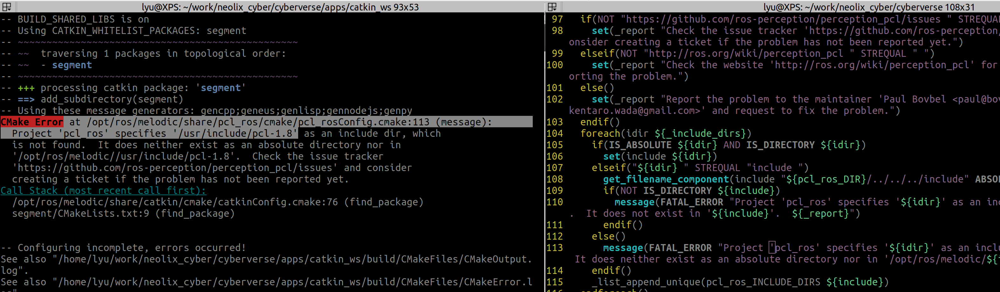

# Coding Debug Tips

## c++ 工程管理

## c++ 代码
### 单例使用中构造函数问题

```cpp
/**
 * @brief 单例模式宏定义内有默认构造
 */
#define DECLARE_SINGLETON_HMI(classname)                               \
 public:                                                               \
  static const std::shared_ptr<classname> &Instance() {                \
    static auto instance = std::shared_ptr<classname>(new classname());\
    return instance;                                                   \
  }                                                                    \
                                                                       \
 private:                                                              \
  classname(); /*声明默认构造函数*/                                       \
  DISALLOW_COPY_AND_ASSIGN(classname)
/**
 * @brief HDMap头文件中不可再申明默认构造，直接在cc文件实现默认构造即可
 */
class HDMap {
 public:
//   HDMap() = default;  //此处的默认构造会和宏定义中的申明冲突
  ~HDMap() = default;

  const std::string& get_version();
  Point2D local_point_;
  DECLARE_SINGLETON_HMI(HDMap);
};
```
### opencv
`cvtColor CV_BGR2GRAY未声明的标识符` 头文件引入 `#include <opencv2/imgproc/types_c.h>` 即可
   
### 栈溢出
**[堆栈问题]诡异问题 Stack smashing detected**


问题描述：
普通数组、std::array定义的数组在初始化时如果分配的空间比较大(位于栈区)，很容易存在Stack smashing的问题
如std::array<std::array<Cell 200>, 800> polar_data{};大概率存在栈区溢出引起程序诡异的偶发中断，而且无明显线索
解决方法：
避免在栈区分配较大的空间，最好使用`new`操作符在堆空间申请内存(如vector、map等)

### 头文件引用的位置和顺序


e.g.1 lidar_segmentation中引用lidar_common中的hpp文件时的顺序问题(使用clang-format的坑)引发的危机

e.g.2 pose_preparation中data_loader.h中引入头文件后，pose_preparation.h又引入data_loader.h引起`multiple definition of `， 通过将相关的头文件从data_loader.h移到pose_preparation.h得以解决

### pcl调用问题

```
问题描述：
cyberverse/apps/catkin_ws下新加segment的nodelet包，调用cyberverse/src/lidar_segment库
lidar_segment库依赖gears里面的pcl，不管ros-segment包依赖系统pcl还是gears里的pcl都不正常

原因：
1. gears里面pcl和系统的pcl存在版本不一致问题,所以会启动失败
2. ros-segment里面用到的pcl_ros指定依赖系统的pcl,所以ros-segment只能依赖系统pcl
```
### 指针未初始化就直接使用
```
Assertion 'px != 0' failed. means that you're using a boost::shared_ptr before it's initialized somewhere.
```
### c++函数返回类型不能使用别名
```cpp
typedef pcl::PointXYZI PointT;
typedef pcl::PointCloud<PointT> PointCloud;
//头文件声明处，函数返回类型可使用别名
PointCloud::Ptr NormalFiltering(const PointCloud::Ptr& cloud);
//cc文件，函数返回类型不可以使用别名
PointCloud::Ptr NormalFiltering(const PointCloud::Ptr& cloud) {......} //PointCloud不识别
pcl::PointCloud<pcl::PointXYZI>::Ptr ClusterFilter::NormalFiltering() {....} //写具体才行
```
### 不能使用系统函数名做变量名称
```cpp
#include <stdlib.h>
//int rand = rand()%100 + 1;将报错`‘rand’ cannot be used as a function`
int index = rand()%100 + 1; 
```
### 未声明的变量传入
```cpp
//使用1-正确使用，内部初始化--调用的函数内部初始化指针，然后传入的`指针的引用变量`引用`函数内初始化好的指针`
PointCloudRgbPtr cloud_abovergb
//void AddColorForCloud(const PointCloudConstPtr cloud, PointCloudRgbPtr& cloud_rgb);
AddColorForCloud(const PointCloudConstPtr cloud, PointCloudRgbPtr& cloud_abovergb);

//使用2-正确使用，外部初始化--调用的函数内部直接引用外部初始化好的指针变量
PointCloudRgbPtr cloud_abovergb(new PointCloudRgb);
//void AddColorForCloud(const PointCloudConstPtr cloud, PointCloudRgbPtr& cloud_rgb);
AddColorForCloud(const PointCloudConstPtr cloud, PointCloudRgbPtr& cloud_abovergb);

//使用3-错误使用，内部初始化--只传入指针，cloud_abovergb将始终未初始化
PointCloudRgbPtr cloud_abovergb;
//void AddColorForCloud(const PointCloudConstPtr cloud, PointCloudRgbPtr cloud_rgb);
AddColorForCloud(const PointCloudConstPtr cloud, PointCloudRgbPtr cloud_abovergb);
```