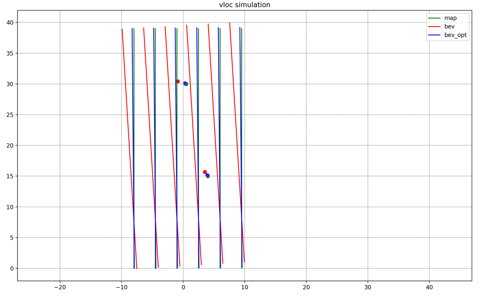

# 高斯牛顿实践-以视觉定位为例
视觉定位当前主要基于线特征(如车道线、停止线)、点特征(杆状物、如地表marking、Y型点)进行约束构建，然后基于粒子滤波和卡尔曼滤波实现状态估计，对于点点约束、点线或点面等约束也可以采用优化的方法进行解决。
## 2D空间 
### 待优化变量
$x = (\theta, t_x, t_y)$表示yaw及二维translation的变化
$$
P = 
\begin{bmatrix}
P_x \\\\
P_y
\end{bmatrix} = 
\begin{bmatrix}
\cos \theta, & \sin \theta \\\\
\sin \theta, & \cos \theta
\end{bmatrix}
\begin{bmatrix}
x_i \\\\
y_i
\end{bmatrix} + 
\begin{bmatrix}
t_x \\\\
t_y
\end{bmatrix} =
\begin{bmatrix}
\cos \theta x_i - \sin \theta y_i + t_x \\\\
\sin \theta x_i + \cos \theta y_i + t_y
\end{bmatrix} \tag{1}
$$
### 点到线cost function 
即优化点$P$到线段$P_1 \quad P_2$的距离
$$
f(x) =f[P(x)]  = \frac{|PP_1 \times PP_2|}{|P_1P_2|} = \frac{|PP_{1x} PP_{2y} - PP_{1y} PP_{2x}|}{|P_1P_2|} = d   \tag{2}
$$
#### 计算jacobian
$$
J^TJ \Delta x = -J^T\cdot f(x) \\\\
H \Delta = - g ,\quad \text{g is gradient}  \tag{3}
$$

$$
J = 
\begin{bmatrix}
\frac{\partial f}{\partial \theta} \\\\
\frac{\partial f}{\partial t_x} \\\\
\frac{\partial f}{\partial t_y}
\end{bmatrix}^T =  
\frac{\partial f}{\partial P}\frac{\partial P}{\partial x(\theta, t_x, t_y)} =  
\begin{bmatrix}
\frac{\partial f}{\partial P_x} \frac{\partial P_x}{\partial \theta} + \frac{\partial f}{\partial P_y} \frac{\partial P_y}{\partial \theta} \\\\
\frac{\partial f}{\partial P_x} \frac{\partial P_x}{\partial t_x} + \frac{\partial f}{\partial P_y} \frac{\partial P_y}{\partial t_x} \\\\
\frac{\partial f}{\partial P_x} \frac{\partial P_x}{\partial t_y} + \frac{\partial f}{\partial P_y} \frac{\partial P_y}{\partial t_y} 
\end{bmatrix}^T.  \tag{4}
$$

#### 详细计算Jacobian
$$
set \quad A =PP_{1x} PP_{2y} - PP_{1y} PP_{2x}   \quad and \quad B = {|P_1P_2|} \\\\
$$

$$
\begin{aligned}
(f(x))^2 = \frac{A^2}{B^2} =d^2 \\\\
2f(x){f}'(x) = \frac{2A{A}'}{B^2} 
\end{aligned}\tag{5} 
$$

公式$(5)$两边同时对$P_x$求导
$$ 
\begin{align}
2d \frac{\partial f}{\partial P_x} 
&= \frac{2A}{B^2} \frac{\partial A}{\partial P_x}\\\\
&= \frac{2A}{B^2} \cdot(PP_{2y} - PP_{1y})     
\end{align}
$$

$$
\frac{\partial f}{\partial P_x} =  \frac{A \cdot P_1P_{2y}}{d\cdot B^2}  \tag{6}
$$

公式$(5)$两边同时对$P_y$求导
$$
\begin{align}
2d \frac{\partial f}{\partial P_y} = \frac{2A}{B^2} \frac{\partial A}{\partial P_y} = \frac{2A}{B^2} \cdot(PP_{1x} - PP_{2x}) \\\\
\frac{\partial f}{\partial P_y} =  \frac{A \cdot P_2P_{1x}}{d\cdot B^2} =  \frac{ - A \cdot P_1P_{2x}}{d\cdot B^2}  
\end{align} \tag{7}
$$

$P(x)对 x = (\theta, t_x, t_y)求导$
$$
\frac{\partial P}{\partial x} = 
\begin{bmatrix}
\frac{\partial P_x}{\partial \theta} \quad \frac{\partial P_x}{\partial t_x} \quad \frac{\partial P_x}{\partial t_y}
 \\\\
 \frac{\partial P_y}{\partial \theta} \quad \frac{\partial P_y}{\partial t_x} \quad \frac{\partial P_y}{\partial t_y}
\end{bmatrix}  \tag{8}
$$

$$
\begin{aligned}
\frac{\partial P_x}{\partial \theta} = -\sin \theta x_i - \cos \theta y_i \quad \quad \frac{\partial P_x}{\partial t_x} = 1 \quad \quad \frac{\partial P_x}{\partial t_y} = 0 \\\\
\frac{\partial P_y}{\partial \theta} = \cos \theta x_i - \sin \theta y_i \quad \quad \frac{\partial P_y}{\partial t_x} = 0 \quad \quad \frac{\partial P_y}{\partial t_y} = 1 
\end{aligned}   \tag{9}
$$

#### 代码如下
```py
class CostFunctionPointToLine:
    def __init__(
        self, src_pt: Point, tar_pt1: Point, tar_pt2: Point, score: np.identity
    ) -> None:
        self.src_point = src_pt
        self.tar_point1 = tar_pt1
        self.tar_point2 = tar_pt2
        self.score = score

        self.delta_f_to_px = 0.0
        self.delta_f_to_py = 0.0
        self.delta_px_to_theta = 0.0
        self.delta_py_to_theta = 0.0

    def compute_residual(self, parameter: np.array((3, 1))) -> float:
        param_yaw = params[0][0]
        param_tx = params[1][0]
        param_ty = params[2][0]
        tmp_src_pt = self.src_point.transform_point(param_yaw, param_tx, param_ty)

        # residual = 0
        pp1 = tmp_src_pt - self.tar_point1
        pp2 = tmp_src_pt - self.tar_point2
        p1p2 = self.tar_point1 - self.tar_point2
        ##f_value_distance_to_line
        residual = tmp_src_pt.distance_to_line(self.tar_point1, self.tar_point2)

        # jacobian
        if residual > 0:
            A = pp1.cross_multi(pp2)
            B = p1p2.squre_norm()
            self.delta_f_to_px = p1p2.y * A / (residual * B)
            self.delta_f_to_py = -p1p2.x * A / (residual * B)
            delta_pt_to_theta = self.src_point.jacobian_point_to_theta(param_yaw)
            self.delta_px_to_theta = delta_pt_to_theta.x
            self.delta_py_to_theta = delta_pt_to_theta.y
        return residual*self.score
    def compute_jacobian(self) -> np.array((1, 3)):
        jacobian = np.zeros((1, 3))
        # delta to yaw
        jacobian[0, 0] = (
            self.delta_f_to_px * self.delta_px_to_theta
            + self.delta_f_to_py * self.delta_py_to_theta
        )
        # delta to tx
        jacobian[0, 1] = self.delta_f_to_px
        # delta to ty
        jacobian[0, 2] = self.delta_f_to_py
        return jacobian
```
### 点到点cost function
即优化点$P$到目标点$P_t$的距离
$$
f(x) = f[P(x)] = |PP_t| = d.  \tag{10}
$$

#### 计算jacobian
$\dfrac{\partial P_x}{\partial \theta}$和 $\dfrac{\partial P_y}{\partial \theta}$同点到线一致
$$
\frac{\partial f}{\partial P_x} =  \frac{\partial f}{\partial P_y} = \frac{1}{d}  \tag{11}
$$
#### 代码如下
```py
class CostFunctionPoint2Point:
    def __init__(self, src_pt: Point, tar_pt: Point, score: np.identity) -> None:
        self.src_point = src_pt
        self.tar_point = tar_pt
        self.score = score

        self.delta_f_to_px = 0
        self.delta_f_to_py = 0
        self.delta_px_to_theta = 0.0
        self.delta_py_to_theta = 0.0

    def compute_residual(self, parameter: np.array((3, 1))) -> float: 
        param_yaw = params[0][0]
        param_tx = params[1][0]
        param_ty = params[2][0]
        tmp_src_pt = self.src_point.transform_point(param_yaw, param_tx, param_ty)

        residual = tmp_src_pt.distance_to_point(self.tar_point) 
        if residual > 0:
            self.delta_f_to_px = 1 / residual
            self.delta_f_to_py = 1 / residual
            delta_pt_to_theta = self.src_point.jacobian_point_to_theta(param_yaw)
            self.delta_px_to_theta = delta_pt_to_theta.x
            self.delta_py_to_theta = delta_pt_to_theta.y
        return residual * self.score

    def compute_jacobian(self) -> np.array((1, 3)):
        jacobian = np.zeros((1, 3))
        # delta to yaw
        jacobian[0, 0] = (
            self.delta_f_to_px * self.delta_px_to_theta
            + self.delta_f_to_py * self.delta_py_to_theta
        )
        # delta to tx
        jacobian[0, 1] = self.delta_f_to_px
        # delta to ty
        jacobian[0, 2] = self.delta_f_to_py
        return jacobian
```
### 优化求解
```py
def solver(self, options):
        self.options = options
        self.construct_problem()
        print(" options.iter_num:", self.options.iter_num)

        for iter in np.arange(self.options.iter_num):
            print("xxxxxxxxxxxxxxxxxxxxxxxxxxxx optimizer iter: %d" % iter)
            k_pairs_num = self.problem.measurements_dims()
            jacobian = np.zeros((k_pairs_num, self.parameters_dims()))
            fx_residuals = np.zeros((k_pairs_num, self.cost_function_dims()))
            for id in np.arange(k_pairs_num):
                fx_value = self.problem.cost_function_list[id].compute_residual(
                    self.parameters
                )
                if fx_value > 0:
                    fx_residuals[id] = fx_value
                    jacobian[id] = self.problem.cost_function_list[
                        id
                    ].compute_jacobian()
            H = np.dot(jacobian.T, jacobian)
            gradient = np.dot(jacobian.T, fx_residuals)
            #solve: H*delta_x = -JT*f
            # gradient_delta = np.linalg.solve(H, -gradient)

            gradient_delta = CompareDiffDecompositionNumpy(H, -gradient) 

            # TODO: optimizer coverage or not, condition is gradient_delta or costfunction value is fine
            if math.fabs(gradient_delta[0][0]) < 1e-6:
                print("solver done, final gradient_delta:", gradient_delta[0][0])
                self.covergence = True
                break
            self.parameters_plus(gradient_delta)
```
## 3D空间
### 优化变量用例
$x = \{yaw \quad pitch  \quad roll \quad x \quad y\quad  z\}$
如Loam系列等，对旋转求导繁琐负责，容易出错
### 基于SO(3)+t
$x = \{ R \quad t\}$
### 点到点cost function
$$
f(x) = f(\{R,t\}) = P_i - (Rq_i+t) \tag{12}
$$
#### 计算jacobian

$$
\begin{align}
\frac{\partial f(x)}{\partial R} = Rq_i^{\times} \\\\
\frac{\partial f(x)}{\partial t} = -I    
\end{align} \tag{13}
$$

相当于最小化 $f(x) = f(\{R,t\}) = \min\limits_{R,t}\sum_i|P_i - (Rq_i+t)|^2$
#### 代码如下
```py
class CostFunctionPoint2Point:
    def __init__(self, src_pt: Point, tar_pt: Point, score: np.identity) -> None:
        self.src_point = src_pt
        self.tar_point = tar_pt
        self.score = score  # 6x6
        self.J = np.zeros((3, 6)) 
    def compute_residual(self, parameter: np.array((6, 1))): 
        param_yaw = params[0][0]
        param_tx = params[3][0]
        param_ty = params[4][0]
        tmp_src_pt = self.src_point.transform_point(param_yaw, param_tx, param_ty, 0.0)

        R = get_matrix33_yaw(param_yaw)
        delta_e_to_R = np.dot(R, self.src_point.skew_symmetric())
        delta_e_to_t = -np.identity(3)
        self.J[:, :3] = delta_e_to_R
        self.J[:, 3:] = delta_e_to_t
        residual = self.tar_point - tmp_src_pt
        return residual.to_vec3d() * self.score
    def compute_jacobian(self) -> np.array((3, 6)):
        return self.J
```
### 点到线cost function
$$
f(x) = f(\{R,t\}) =  \frac{|PP_1 \times PP_2|}{|P_1P_2|} =d\times(Rq_i+t - p_1) \tag{14}
$$
#### 计算jacobian
$$
\frac{\partial f(x)}{\partial R} = -d^{\times}Rq_i^{\times}\\\\
\frac{\partial f(x)}{\partial t} = d^{\times}    \tag{15}
$$
#### 代码如下
```py
class CostFunctionPointToLine:
    def __init__(
        self, src_pt: Point, tar_pt1: Point, tar_pt2: Point, score: np.identity
    ) -> None:
        self.src_point = src_pt
        self.tar_point1 = tar_pt1
        self.tar_point2 = tar_pt2
        self.score = score  # 6x6

        self.J = np.zeros((3, 6)) 

    def compute_residual(self, parameter: np.array((6, 1))): 
        param_yaw = params[0][0]
        param_tx = params[3][0]
        param_ty = params[4][0]
        tmp_src_pt = self.src_point.transform_point(param_yaw, param_tx, param_ty, 0.0)

        p2p1 = self.tar_point2 - self.tar_point1
        d_vec = p2p1.normlize()
        d_vec_skew = d_vec.skew_symmetric()
        pp1 = tmp_src_pt - self.tar_point1
        R = get_matrix33_yaw(param_yaw)
        # print("d_vec_skew:\n",d_vec_skew)
        # print("R:\n",R)
        delta_e_to_R = -np.dot(np.dot(d_vec_skew, R), self.src_point.skew_symmetric())
        delta_e_to_t = d_vec_skew
        self.J[:, :3] = delta_e_to_R
        self.J[:, 3:] = delta_e_to_t
        residual = np.dot(d_vec_skew, pp1.to_vec3d())
        return residual * self.score

    def compute_jacobian(self) -> np.array((3, 6)):
        return self.J

```
## 优化效果示例
如下图所示，模拟视觉定位生成6条车道线和2个地标marking, 车道线间距3.5m, 长度40m, 
- 绿色表示高精地图车道线
- 红色表示感知车道心线：通过对地图车道线添加最大10cm噪声并进行$R: yaw = 3.5deg   x横向: 0.5.   y:0.5m$的变换
- 蓝色：通过2D or 3D优化后的结果



---

Loam(Lego-Loam后端优化推导)


[LOAM后端优化算法分析](https://zhuanlan.zhihu.com/p/205648834)
## 三维变换(Lego-Loam后端推导)
其中旋转矩阵R定义如下，使用的是欧拉角表示方式，s表示sin，c表示cos，例如cry表示cos(ry)

$rx、ry、rz$分别表示绕轴$X、Y、Z$的角
$$
R=R(rx,ry,rz) = 
\begin{bmatrix}
c_{ry}c_{rz}+s_{rx}s_{ry}s_{rz} &c_{rz}s_{rx}s_{ry} - c_{ry}s_{rz} & c_{rx}s_{ry} \\\\
c_{rx}s_{rz} & c_{rx}c_{rz} & -s_{rx} \\\\
c_{ry}s_{rx}s_{rz} - c_{rz}s_{ry} & c_{ry}c_{rz}s_{rx} + s_{ry}s_{rz}& c_{rx}c_{ry}
\end{bmatrix} \tag{1}
$$
平移t:

$$
T=(t_x,t_y,t_z)^T
$$
## 变量
$x = (r_x,r_y,r_z, t_x, t_y,t_z)$, 表示$roll、pitch、yaw$及translation的变化
## 点线cost function
即优化点$P$到线段$P_1 \quad P_2$的距离,以求得$x = (r_x,r_y,r_z, t_x, t_y,t_z)$

$$
f(x) =f[P(x)]  = \dfrac{|PP_1 \times PP_2|}{|P_1P_2|} = \dfrac{\sqrt{a^2+b^2+c^2}}{|P_1P_2|} = d \tag{2}
$$

其中$PP_1 \times PP_2 = (a,b,c)$,且

$$
\begin{align}
a=PP_{1x}PP_{2y} - PP_{2x}PP_{1y} \\\\
b=PP_{1x}PP_{2z} - PP_{2x}PP_{1z} \\\\
c=PP_{1y}PP_{2z} - PP_{2y}PP_{1z}
\end{align}
$$
### 优化求解优过程
即求解$x = (r_x,r_y,r_z, t_x, t_y,t_z)$的过程，损失函数为

$$
f(x)  = d = f(P^w, Target) = f[G(x), Target]
$$ 

1. 给定初始值$x_0$
2. 对于第$k$次迭代, 求jacobian和f(x)
3. 求解增量方程 $H \Delta x = -g,\quad H = J^TJ, \quad g = J^Tf(x)$
4. 如果$\Delta x_k$或者损失函数$f(x_k)$ 足够小，则优化停止，否则令$x_{k+1} = x_k+\Delta x$ ,然后step2

#### step2详解：求Jocabian
- 将第$i$个观测通过变量$x_k$进行转换 
  $$P^w = G(x)=TP=RP+t \\\\ \quad \quad T=(R,t) = (r_x,r_y,r_z, t_x, t_y,t_z)^T
  $$
$$
P^{iw} = 
\begin{bmatrix}
P_x \\\\
P_y \\\\
P_z
\end{bmatrix} = R 
\begin{bmatrix}
x_i \\\\
y_i \\\\
z_i
\end{bmatrix} + 
\begin{bmatrix}
t_x \\\\
t_y \\\\
t_z
\end{bmatrix} = T_i P_i \tag{3}
$$
#### 计算jacobian
单次观测Jacobian为
$$
J_i = 
\begin{bmatrix}
\dfrac{\partial f}{\partial r_x} \\\\
\dfrac{\partial f}{\partial r_y} \\\\
\dfrac{\partial f}{\partial r_z} \\\\
\dfrac{\partial f}{\partial t_x} \\\\
\dfrac{\partial f}{\partial t_y} \\\\
\dfrac{\partial f}{\partial t_z} 
\end{bmatrix}^T = 
\dfrac{\partial f}{\partial P^{w}}\dfrac{\partial P^{w}}{\partial x} =
\begin{bmatrix}
\dfrac{\partial f}{\partial P_x} \dfrac{\partial P_x}{\partial r_x} + \dfrac{\partial f}{\partial P_y} \dfrac{\partial P_y}{\partial r_x} + \dfrac{\partial f}{\partial P_z} \dfrac{\partial P_z}{\partial r_x} \\\\
\dfrac{\partial f}{\partial P_x} \dfrac{\partial P_x}{\partial r_y} + \dfrac{\partial f}{\partial P_y} \dfrac{\partial P_y}{\partial r_y} + \dfrac{\partial f}{\partial P_z} \dfrac{\partial P_z}{\partial r_y} \\\\
\dfrac{\partial f}{\partial P_x} \dfrac{\partial P_x}{\partial r_z} + \dfrac{\partial f}{\partial P_y} \dfrac{\partial P_y}{\partial r_z} + \dfrac{\partial f}{\partial P_z} \dfrac{\partial P_z}{\partial r_z} \\\\
\dfrac{\partial f}{\partial P_x} \dfrac{\partial P_x}{\partial t_x} + \dfrac{\partial f}{\partial P_y} \dfrac{\partial P_y}{\partial t_x}+ \dfrac{\partial f}{\partial P_z} \dfrac{\partial P_z}{\partial t_x} \\\\
\dfrac{\partial f}{\partial P_x} \dfrac{\partial P_x}{\partial t_y} + \dfrac{\partial f}{\partial P_y} \dfrac{\partial P_y}{\partial t_y}+ \dfrac{\partial f}{\partial P_z} \dfrac{\partial P_z}{\partial t_y} \\\\
\dfrac{\partial f}{\partial P_x} \dfrac{\partial P_x}{\partial t_z} + \dfrac{\partial f}{\partial P_y} \dfrac{\partial P_y}{\partial t_z}+ \dfrac{\partial f}{\partial P_z} \dfrac{\partial P_z}{\partial t_z} \\\\
\end{bmatrix}^T  \tag{4}
$$
其中
$$
\dfrac{\partial f}{\partial P^w} =[
\dfrac{\partial f}{\partial P_x} \quad
\dfrac{\partial f}{\partial P_y} \quad
\dfrac{\partial f}{\partial P_z}
] 
$$
为cost function对点的导数，具体到点到线和点到面距离d即为：距离d对点求导，可理解为求一个点的移动方向，在这个方向上移动d减小的最快，显然是垂线方向

所有观测对应Jacobian为: $m \times n$
$$
J = 
\begin{bmatrix}
J_1 \\\\
J_2 \\\\
... \\\
J_m
\end{bmatrix}
$$

cost function单次结果$f(x) = dx$
所有观测结果为：mx1
$$
f = [f[P_1(x)] \quad f[P_2(x)] \quad ... \quad f[P_m(x)]]^T = [d_1 \quad d_2 \quad ... \quad d_m]^T
$$
#### 详细计算Jacobian
cost function
即优化点$P$到线段$P_1 \quad P_2$的距离,以求得$x = (r_x,r_y,r_z, t_x, t_y,t_z)$

$$
f(x) =f[P(x)]  = \dfrac{|PP_1 \times PP_2|}{|P_1P_2|} = \dfrac{\sqrt{a^2+b^2+c^2}}{B} = d \tag{5}
$$

其中$P(x) = \quad PP_1 \times PP_2 = (a,b,c)$,且$B = |P_1P_2|$

$$
\begin{align}
a=PP_{1x}PP_{2y} - PP_{2x}PP_{1y} \\\\
b=PP_{1x}PP_{2z} - PP_{2x}PP_{1z} \\\\
c=PP_{1y}PP_{2z} - PP_{2y}PP_{1z} \\\\
\end{align}
$$

- 计算$\dfrac{\partial f}{\partial P_x}$
  - 方法1：公式$5$两边平方,再对$P_x$直接求导

$$
\begin{gather}
   [f(x)]^2 = \dfrac{a^2+b^2+c^2}{B^2} = d^2 \\\\
  2f(x){f}'(x) = \dfrac{2a \dfrac{\partial a}{\partial P_x} + 2b \dfrac{\partial b}{\partial P_x} + 2c \dfrac{\partial c}{\partial P_x}}{B^2}
\end{gather}
$$

$$
\begin{align}
   {f}'(x) &= \dfrac{a \dfrac{\partial a}{\partial P_x} + b \dfrac{\partial b}{\partial P_x}}{d \cdot B^2} \\\\
   &= \dfrac{1}{d\cdot B^2}(a(PP_{2y} - PP_{1y})+b(PP_{2z} - PP_{1z})) \\\\
   &= \dfrac{a P_1P_{2y} + bP_1P{2z}}{d\cdot B^2}
\end{align}
$$
 
  - 方法2：公式$5$对$P_x$直接求导
  
$$
\begin{align}
    {f}'(x) &= \dfrac{2a \dfrac{\partial a}{\partial P_x} + 2b \dfrac{\partial b}{\partial P_x} + 2c \dfrac{\partial c}{\partial P_x} }{B\cdot 2\sqrt{a^2+b^2+c^2}} \\\\
    &= \dfrac{a \dfrac{\partial a}{\partial P_x} + b \dfrac{\partial b}{\partial P_x}}{B\cdot \sqrt{a^2+b^2+c^2}} \quad 然后两边同时乘f(x)
\end{align}
$$

$$
f(x){f}'(x) =  \dfrac{a \dfrac{\partial a}{\partial P_x} + b \dfrac{\partial b}{\partial P_x}}{B^2} 
$$


$$
then, \quad {f}'(x) = \dfrac{\partial f}{\partial P_x} = \dfrac{a \dfrac{\partial a}{\partial P_x} + b \dfrac{\partial b}{\partial P_x}}{d \cdot B^2} 
$$

- 计算$\dfrac{\partial P_x}{\partial r_x}$,由$\quad P^w =RP+t$得

$$
  P_x = (c_{ry}c_{rz} + s_{rx}s_{ry}s_{rz} )x_i + (-c_{ry}s_{rz}+s_{rx}s_{ry}c_{rz})y_i+ s_{ry}c_{rx}z_i + t_x
$$

$$
  \dfrac{\partial P_x}{\partial r_x} = c_{rx}s_{ry}s_{rz} x_i + c_{rx}s_{ry}c_{rz}y_i  - s_{ry}s_{rx}z_i
$$ 

## 点到面cost function

$P$为观测点，$P_i$为平面一点，$n$为平面法向量

$$
\begin{align}
f(x) = f[P(x)] = |PP_1|\cdot |n|\cdot cos<PP_1,n> = d 
\end{align}
$$

$$
f(x) = f[P(x)]  =PP_1 \cdot n =  n_x(x - x_i) + n_y(y - y_i) + n_z(z - z_i) 
$$

Jacobian计算

$$
\dfrac{\partial f}{\partial P} = 
\begin{bmatrix}
    \dfrac{\partial f}{\partial P_x} \\\\
    \dfrac{\partial f}{\partial P_y} \\\\
    \dfrac{\partial f}{\partial P_z} 
\end{bmatrix}^T = 
\begin{bmatrix}
    n_x \\\\
    n_y \\\\
    n_z
\end{bmatrix}^T
$$