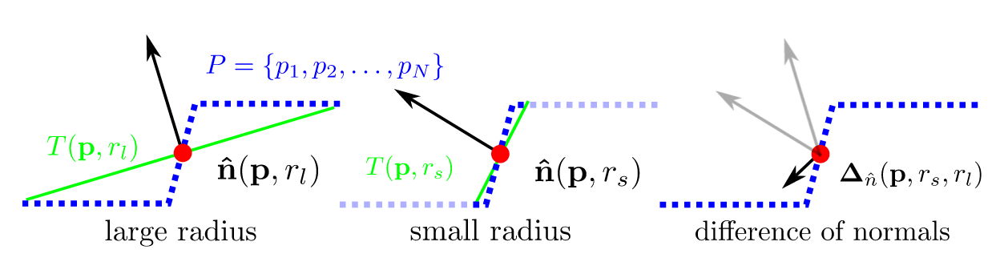
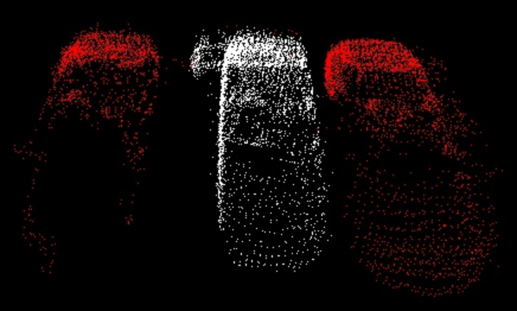

找到较早期整理的文档, 保存一下到blog.
<!--more-->
# 传统分割方法
典型方法pcl参见[pcl documentation](http://pointclouds.org/documentation/tutorials/index.php),且有使用实例

## 基于几何特征
基于sphere/cone/plane/cylinder等数学规则进行拟合
<!--  -->

## 区域增长(应用广泛、持续研究中)
基于各种特征及组合特征的区域增长(欧式距离聚类本质为区域增长,判断欧式距离)等。
核心思想就是从一个点出发,依据约束条件(距离、法向量、密度度量、凹凸性、曲率等)最终增长扩散为一簇
<!--  -->

- 基本流程

- 点云特征
  
  
  
## 最小分割
基于图论,应用网络规划,求解桥问题,图像分割等领域,被移植到点云分割,点之间连接为图,赋予连线权值,获得点之间的拓扑关系，分割目标需要人为指定(如指定了目标物体上的一个点)!!!。

## 基于形态学分割(图像处理算法衍生到点云)
航空摄影测量中为去除地面噪声对地形测量的影响,不使用地面平整假设的前提下获得地面机载lidar 测量方向和地面垂直,形成xy->z映射(z方向的范围远远小于xy方向),z方向代表地面物体的高度,x,y方向为平行与地面且相互垂直的两个轴

## 超体聚类
基于Octree八叉树对点云进行划分均匀分布,获得不同点团之间的邻接关系

所有的晶核(seed)同时开始生长,最终填满整个空间完成分割,本质还是基于区域生长思想。
首先需要规律的布置区域生长晶核(晶核在空间中实际上是均匀分布), 并指定晶核距离(Rseed),粒子距离(Rvoxel),最小晶粒(MOV),过小的晶粒需要融入最近的大晶粒

有了晶核(seed)和结晶范围(搜索半径)之后,然后控制结晶过程(增长约束条件)以完成分割

 

##  LCCP(Locally Convex Connected Pathches)基于超体聚类(凹凸关系)
1. 基于超体聚类实现过分割
2. 基于空间信息和法线信息,在超体聚类的基础上再聚类去除过分割
3. 对于过分割的点云计算不同的块之间凹凸关系并记录,然后基于区域增长将小区域聚类成较大的物体(只允许区域跨越凸边增长)

# 投影方法(维度损失)
- 基于虚拟图像平面投影
  将点云投影为rang-image/intensity-image基于激光束特性、和雷达自身参数相关

- 基于2D-Grid地面方格或极坐标格投影(DAPAR挑战赛中广泛使用)
  投影到2D-grid raster参数根据点云数据调整,单独使用容易分割不足或过分割

# 深度学习
3D grid+PointNet+3D CNN、 MinCut、KPCon、 RS-CNN....语义分割
Hugues et al KPConv.arXiv 2019
pointpillar
准确率、召回率之间较好的平衡