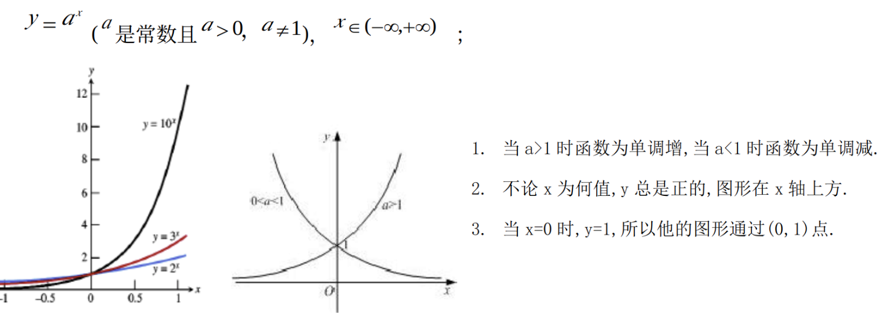
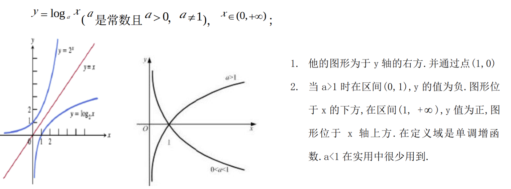

# 函数
## 指数函数

**基本性质**

$y = a^x, a>0且a≠1$, 其中 $a$ 为底数常数，$x$ 为指数变量。

- 定义域： $(-\infty, \infty) 即\quad\mathbb{R}$ 或 $\mathbb{C}$，值域：  $(0, \infty)$
- 单调性： a > 1 时，指数函数单调递增；a < 1 时，指数函数单调递减；a = 1 时，指数函数恒为 1。
- 特殊性：恒过点$(0,1),即 有= a^0 = 1$。
  
**运算性质**

- $a^{x+y} = a^x \cdot a^y$
- $a^{x-y} = \frac{a^x}{a^y}$
- $(a^x)^y = a^{xy}$
- $a^{-1}  = \frac{1}{a^x}$
- $a^1 = a \quad a^0 = 1$
- $a^x = e^{x\log_a(a)}$
- 求导：$f(x) = a^x \quad f'(x) = a^x \ln(a),其中\ln(a)为以为e为底a的对数$

## 对数函数

**基本性质**

- 定义域 $x \in (0, \infty)$,  值域：$y \in (-\infty, \infty)$
- 单调性：$a > 1 \quad y$ 单调递增, $0< a < 1 \quad y$ 单调递减 
- 特殊点: $y = \log_a(x)$ 恒过点$(1,0)$,即 $\log_a(1) = 0$

**运算性质**

- $\log_a(xy) = \log_a(x) + \log_a(y)$
- $\log_a(\frac{x}{y}) = \log_a(x) - \log_a(y)$
- $\log_a(x^n) = n\log_a(x)$
- $\log_a(\frac{1}{x}) = \log_ax^{-1} = -\log_a(x)$
- $\log_a(e^x) = x \quad a = e$
- $\log_a(a^x) = x \quad \log_a(1) = 0 \quad \log_a(a) = 1$
- 换底部：$\log_a(x) = \frac{\log_b(x)}{\log_b(a)}$
- 求导：$f(x) = \log_a(x) \quad f'(x) = \frac{1}{x\ln(a)},其中\ln(a)为以为e为底a的对数$

## 正太分布函数

随机变量$X$服从均值为 $\mu$、标准差为$\sigma$ 的正太分布，即 $X \sim N(\mu, \sigma^2 )$, 则

$$
f(x) = \dfrac{1}{\sigma \sqrt{2\pi } } e^{- \dfrac{(x-\mu )^2}{2\sigma ^2} }
$$

## 概率
$P(a,b) = P(a) \cdot P(b)$
<!-- 

 -->